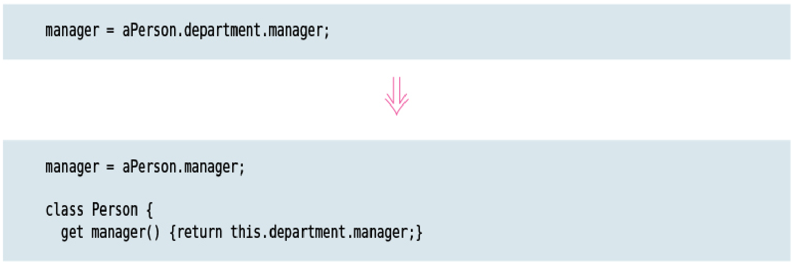

# Chapter 7 Encapsulation

Perhaps the most important criteria to be used in decomposing modules is to identify secrets that modules should hide from the rest of the system. Data structures are the most common secrets, and I can hide data structures by encapsulating them with *`Encapsulate Record (162)`* and *`Encapsulate Collection (170)`*. Even primitive data values can be encapsulated with *`Replace Primitive with Object (174)`*—the magnitude of second­order benefits from doing this often surprises people. Temporary variables often get in the way of refactoring—I have to ensure they are calculated in the right order and their values are available to other parts of the code that need them. Using *`Replace Temp with Query (178)`* is a great help here, particularly when splitting up an overly long function.  

Classes were designed for information hiding. In the previous chapter, I described a way to form them with *`Combine Functions into Class (144)`*. The common extract/inline operations also apply to classes with *`Extract Class (182)`* and *`Inline Class (186)`*.

As well as hiding the internals of classes, it’s often useful to hide connections between classes, which I can do with *`Hide Delegate (189)`*. But too much hiding leads to bloated interfaces, so I also need its reverse: *`Remove Middle Man (192)`*.

Classes and modules are the largest forms of encapsulation, but functions also encapsulate their implementation. Sometimes, I may need to make a wholesale change to an algorithm, which I can do by wrapping it in a function with *`Extract Function (106)`* and applying *`Substitute Algorithm (195)`*.

## ENCAPSULATE RECORD

formerly: *Replace Record with Data Class*


### Motivation

This is why I often favor objects over records for mutable data. With objects, I can hide what is stored and provide methods for all three values. The user of the object doesn’t need to know or care which is stored and which is calculated. This encapsulation also helps with renaming: I can rename the field while providing methods for both the new and the old names, gradually updating callers until they are all done.

I just said I favor objects for *`mutable`* data. If I have an immutable value, I can just have all three values in my record, using an enrichment step if necessary. Similarly, it’s easy to copy the field when renaming.

I can have two kinds of record structures: those where I declare the legal field names and those that allow me to use whatever I like. The latter are often implemented through a library class called something like hash, map, hashmap, dictionary, or associative array. Many languages provide convenient syntax for creating hashmaps, which makes them useful in many programming situations. The downside of using them is they are aren’t explicit about their fields. The only way I can tell if they use start/end or start/length is by looking at where they are created and used. This isn’t a problem if they are only used in a small section of a program, but the wider their scope of usage, the greater problem I get from their implicit structure. I could refactor such implicit records into explicit ones—but if I need to do that, I’d rather make them classes instead.

It’s common to pass nested structures of lists and hashmaps which are often serialized into formats like JSON or XML. Such structures can be encapsulated too, which helps if their formats change later on or if I’m concerned about updates to the data that are hard to keep track of.

#### *Mechanics*

* Use *`Encapsulate Variable (132)`* on the variable holding the record.

    Give the functions that encapsulate the record names that are easily searchable.

* Replace the content of the variable with a simple class that wraps the record. Define an accessor inside this class that returns the raw record. Modify the functions that encapsulate the variable to use this accessor.

* Test.

* Provide new functions that return the object rather than the raw record.

* For each user of the record, replace its use of a function that returns the record with a function that returns the object. Use an accessor on the object to get at the field data, creating that accessor if needed. Test after each change.

    If it’s a complex record, such as one with a nested structure, focus on clients that update the data first. Consider returning a copy or read­only proxy of the data for clients that only read the data.

* Remove the class’s raw data accessor and the easily searchable functions that returned the raw record.

* Test.

* If the fields of the record are themselves structures, consider using *`Encapsulate Record`* and *`Encapsulate Collection (170)`* recursively.

## ENCAPSULATE COLLECTION


### Motivation

Access to a collection variable may be encapsulated, but if the getter returns the collection itself, then that collection’s membership can be altered without the enclosing class being able to intervene.

To avoid this, I provide collection modifier methods—usually add and remove—on the class itself. This way, changes to the collection go through the owning class, giving me the opportunity to modify such changes as the program evolves.

### Mechanics

* Apply *`Encapsulate Variable (132)`* if the reference to the collection isn’t already encapsulated.

* Add functions to add and remove elements from the collection.

    If there is a setter for the collection, use *`Remove Setting Method (331)`* if possible. If not, make it take a copy of the provided collection.

* Run static checks.

* Find all references to the collection. If anyone calls modifiers on the collection, change them to use the new add/remove functions. Test after each change.

* Modify the getter for the collection to return a protected view on it, using a readonly proxy or a copy.

* Test.

## REPLACE PRIMITIVE WITH OBJECT

formerly: *`Replace Data Value with Object`*  

formerly: *`Replace Type Code with Class`*  


### Motivation

Often, in early stages of development you make decisions about representing simple facts as simple data items, such as numbers or strings. As development proceeds, those simple items aren’t so simple anymore. A telephone number may be represented as a string for a while, but later it will need special behavior for formatting, extracting the area code, and the like. This kind of logic can quickly end up being duplicated around the code base, increasing the effort whenever it needs to be used.

As soon as I realize I want to do something other than simple printing, I like to create a new class for that bit of data. At first, such a class does little more than wrap the primitive—but once I have that class, I have a place to put behavior specific to its needs. These little values start very humble, but once nurtured they can grow into useful tools. They may not look like much, but I find their effects on a code base can be surprisingly large. Indeed many experienced developers consider this to be one of the most valuable refactorings in the toolkit—even though it often seems counterintuitive to a new programmer.

### Mechanics

* Apply *`Encapsulate Variable (132)`* if it isn’t already.

* Create a simple value class for the data value. It should take the existing value in its constructor and provide a getter for that value.

* Run static checks.

* Change the setter to create a new instance of the value class and store that in the field, changing the type of the field if present.

* Change the getter to return the result of invoking the getter of the new class.

* Test.

* Consider using *`Rename Function (124)`* on the original accessors to better reflect what they do.

* Consider clarifying the role of the new object as a value or reference object by applying *`Change Reference to Value (252)`* or *`Change Value to Reference (256)`*.

```js
constructor(data) 
{   
  this.priority = data.priority;   
  // more initialization
}

highPriorityCount = orders.filter(o => "high" === o.priority || "rush" === o.priority).length;

get priority()        {return this._priority;}
set priority(aString) {this._priority = aString;}

get priority()        {return this._priority.toString();}
set priority(aString) {this._priority = new Priority(aString);}

class Priority {
   constructor(value) {this._value = value;}
   toString() {return this._value;}
}

get priority()        {return this._priority.toString();}
set priority(aString) {this._priority = new Priority(aString);}

get priorityString()  {return this._priority.toString();}
set priority(aString) {this._priority = new Priority(aString);}

highPriorityCount = orders.filter(o => "high" === o.priorityString || "rush" === o.priorityString).length;

get priority()        {return this._priority;}
get priorityString()  {return this._priority.toString();} set priority(aString) {this._priority = new Priority(aString);}

highPriorityCount = orders.filter(o => "high" === o.priority.toString() || "rush" === o.priority.toString()).length;

constructor(value) 
{
  if (value instanceof Priority) return value;   
  this._value = value;
}
```


## REPLACE TEMP WITH QUERY


### Motivation

One use of temporary variables is to capture the value of some code in order to refer to it later in a function. Using a temp allows me to refer to the value while explaining its meaning and avoiding repeating the code that calculates it. But while using a variable is handy, it can often be worthwhile to go a step further and use a function instead.

If I’m working on breaking up a large function, turning variables into their own functions makes it easier to extract parts of the function, since I no longer need to pass in variables into the extracted functions. Putting this logic into functions often also sets up a stronger boundary between the extracted logic and the original function, which helps me spot and avoid awkward dependencies and side effects.

Using functions instead of variables also allows me to avoid duplicating the calculation logic in similar functions. Whenever I see variables calculated in the same way in different places, I look to turn them into a single function.

This refactoring works best if I’m inside a class, since the class provides a shared context for the methods I’m extracting. Outside of a class, I’m liable to have too many parameters in a top­level function which negates much of the benefit of using a function. Nested functions can avoid this, but they limit my ability to share the logic between related functions.

Only some temporary variables are suitable for *`Replace Temp with Query`*. The variable needs to be calculated once and then only be read afterwards. In the simplest case, this means the variable is assigned to once, but it’s also possible to have several assignments in a more complicated lump of code—all of which has to be extracted into the query. Furthermore, the logic used to calculate the variable must yield the same result when the variable is used later

### Mechanics

* Check that the variable is determined entirely before it’s used, and the code that calculates it does not yield a different value whenever it is used.

* If the variable isn’t read­only, and can be made read­only, do so.

* Test.

* Extract the assignment of the variable into a function.

    If the variable and the function cannot share a name, use a temporary name for the function.

    Ensure the extracted function is free of side effects. If not, use *`Separate Query from Modifier (306)`*.

* Test.

* Use *`Inline Variable (123)`* to remove the temp.

```js
class X {
  constructor(quantity, item) {     
    this._quantity = quantity;     
    this._item = item;   
  }

  get price() {     
    var basePrice = this._quantity * this._item.price;     
    var discountFactor = 0.98;     
    if (basePrice > 1000) discountFactor ­= 0.03;     
    return basePrice * discountFactor;   
    }
  }
```

I want to replace the temps basePrice and discountFactor with methods.

Starting with basePrice, I make it const and run tests. This is a good way of checking that I haven’t missed a reassignment—unlikely in such a short function but common when I’m dealing with something larger.

**step 1**
```js
class X {
  constructor(quantity, item) {     
    this._quantity = quantity;     
    this._item = item;   
  }

  get price() {     
    const basePrice = this._quantity * this._item.price;     
    var discountFactor = 0.98;     
    if (basePrice > 1000) discountFactor ­= 0.03;     
    return basePrice * discountFactor;   
    }
  }
```
**step 2**
```js
  get price() {   
    const basePrice = this.basePrice;   
    var discountFactor = 0.98;   
    if (basePrice > 1000) discountFactor ­= 0.03;   
    return basePrice * discountFactor;
  }

  get basePrice() {    
    return this._quantity * this._item.price;  
  }
```
**step 3**
```js
  get price() {   
    var discountFactor = 0.98;   
    if (this.basePrice > 1000) discountFactor ­= 0.03;   
    return this.basePrice * discountFactor;
  }
```
**step 4**
```js
  get price() {   
    const discountFactor = this.discountFactor;   
    return this.basePrice * discountFactor;
  }

  get discountFactor() {    
    var discountFactor = 0.98;    
    if (this.basePrice > 1000) discountFactor ­= 0.03;    
    return discountFactor;  
  }
```
**step 5**
```js
  get price() {   
    return this.basePrice * this.discountFactor;
  }
```

## EXTRACT CLASS

inverse of: *`Inline Class (186)`*


### Motivation

You’ve probably read guidelines that a class should be a crisp abstraction, only handle a few clear responsibilities, and so on. In practice, classes grow. You add some operations here, a bit of data there. You add a responsibility to a class feeling that it’s not worth a separate class—but as that responsibility grows and breeds, the class becomes too complicated. Soon, your class is as crisp as a microwaved duck.

Imagine a class with many methods and quite a lot of data. A class that is too big to understand easily. You need to consider where it can be split—and split it. A good sign is when a subset of the data and a subset of the methods seem to go together. Other good signs are subsets of data that usually change together or are particularly dependent on each other. A useful test is to ask yourself what would happen if you remove a piece of data or a method. What other fields and methods would become nonsense?

One sign that often crops up later in development is the way the class is sub­typed. You may find that subtyping affects only a few features or that some features need to be subtyped one way and other features a different way.

### Mechanics

* Decide how to split the responsibilities of the class.

* Create a new child class to express the split­off responsibilities.

    If the responsibilities of the original parent class no longer match its name, rename the parent.

* Create an instance of the child class when constructing the parent and add a link from parent to child.

* Use *`Move Field (207)`* on each field you wish to move. Test after each move.

* Use *`Move Function (198)`* to move methods to the new child. Start with lower­level methods (those being called rather than calling). Test after each move.

* Review the interfaces of both classes, remove unneeded methods, change names to better fit the new circumstances.

* Decide whether to expose the new child. If so, consider applying *`Change Reference to Value (252)`* to the child class.

## INLINE CLASS

inverse of: *`Extract Class (182)`*


### Motivation

Inline Class is the inverse of *`Extract Class (182)`*. I use Inline Class if a class is no longer pulling its weight and shouldn’t be around any more. Often, this is the result of refactoring that moves other responsibilities out of the class so there is little left. At that point, I fold the class into another—one that makes most use of the runt class.

Another reason to use Inline Class is if I have two classes that I want to refactor into a pair of classes with a different allocation of features. I may find it easier to first use Inline Class to combine them into a single class, then *`Extract Class (182)`* to make the new separation. This is a general approach when reorganizing things: Sometimes, it’s easier to move elements one at a time from one context to another, but sometimes it’s better to use an inline refactoring to collapse the contexts together, then use an extract refactoring to separate them into different elements.

### Mechanics

* In the target class, create functions for all the public functions of the source class. These functions should just delegate to the source class.

* Change all references to source class methods so they use the target class’s delegators instead. Test after each change.

* Move all the functions and data from the source class into the target, testing after each move, until the source class is empty.

* Delete the source class and hold a short, simple funeral service.

## HIDE DELEGATE

inverse of: *`Remove Middle Man (192)`*




One of the keys—if not the key—to good modular design is encapsulation.

Encapsulation means that modules need to know less about other parts of the system. Then, when things change, fewer modules need to be told about the change—which makes the change easier to make.

When we are first taught about object orientation, we are told that encapsulation means hiding our fields. As we become more sophisticated, we realize there is more that we can encapsulate.

If I have some client code that calls a method defined on an object in a field of a server object, the client needs to know about this delegate object. If the delegate changes its interface, changes propagate to all the clients of the server that use the delegate. I can remove this dependency by placing a simple delegating method on the server that hides the delegate. Then any changes I make to the delegate propagate only to the server and not to the clients.


### Mechanics

* For each method on the delegate, create a simple delegating method on the server.

* Adjust the client to call the server. Test after each change.

* If no client needs to access the delegate anymore, remove the server’s accessor for the delegate.

* Test.

## REMOVE MIDDLE MAN

inverse of: *`Hide Delegate (189)`*


In the motivation for *`Hide Delegate (189)`*, I talked about the advantages of encapsulating the use of a delegated object. There is a price for this. Every time the client wants to use a new feature of the delegate, I have to add a simple delegating method to the server. After adding features for a while, I get irritated with all this forwarding. The server class is just a middle man (*`Middle Man (81)`*), and perhaps it’s time for the client to call the delegate directly. (This smell often pops up when people get overenthusiastic about following the Law of Demeter, which I’d like a lot more if it were called the Occasionally Useful Suggestion of Demeter.)

It’s hard to figure out what the right amount of hiding is. Fortunately, with *`Hide Delegate (189)`* and Remove Middle Man, it doesn’t matter so much. I can adjust my code as time goes on. As the system changes, the basis for how much I hide also changes. A good encapsulation six months ago may be awkward now. Refactoring means I never have to say I’m sorry—I just fix it.

### Mechanics

* Create a getter for the delegate.

* For each client use of a delegating method, replace the call to the delegating method by chaining through the accessor. Test after each replacement.

    If all calls to a delegating method are replaced, you can delete the delegating method.

    With automated refactorings, you can use *`Encapsulate Variable (132)`* on the delegate field and then *`Inline Function (115)`* on all the methods that use it.

## SUBSTITUTE ALGORITHM


### Motivation

I’ve never tried to skin a cat. I’m told there are several ways to do it. I’m sure some are easier than others. So it is with algorithms. If I find a clearer way to do something, I replace the complicated way with the clearer way. Refactoring can break down something complex into simpler pieces, but sometimes I just reach the point at which I have to remove the whole algorithm and replace it with something simpler. This occurs as I learn more about the problem and realize that there’s an easier way to do it. It also happens if I start using a library that supplies features that duplicate my code.

Sometimes, when I want to change the algorithm to work slightly differently, it’s easier to start by replacing it with something that would make my change more straightforward to make.

When I have to take this step, I have to be sure I’ve decomposed the method as much as I can. Replacing a large, complex algorithm is very difficult; only by making it simple can I make the substitution tractable.

### Mechanics

* Arrange the code to be replaced so that it fills a complete function.

* Prepare tests using this function only, to capture its behavior.

* Prepare your alternative algorithm.

* Run static checks.

* Run tests to compare the output of the old algorithm to the new one. If they are the same, you’re done. Otherwise, use the old algorithm for comparison in testing and debugging.
