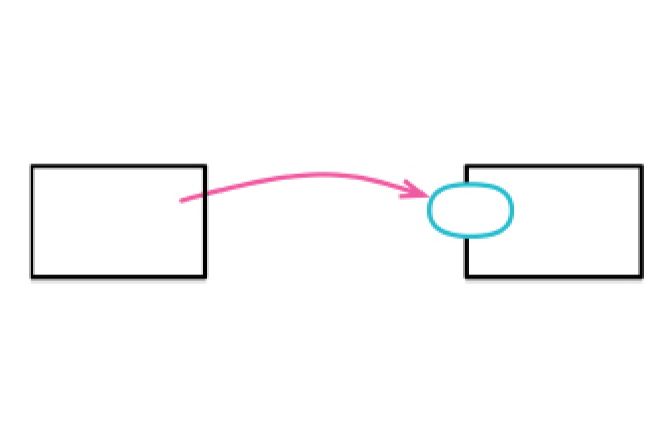
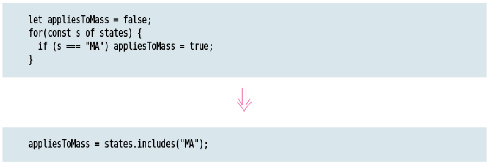

# Chapter 8 Moving Features

So far, the refactorings have been about creating, removing, and renaming program elements. Another important part of refactoring is moving elements between contexts. I use *`Move Function (198)`* to move functions between classes and other modules. Fields can move too, with *`Move Field (207)`*.

I also move individual statements around. I use *`Move Statements into Function (213)`* and *`Move Statements to Callers (217)`* to move them in or out of functions, as well as *`Slide Statements (223)`* to move them within a function. Sometimes, I can take some statements that match an existing function and use Replace Inline Code with *`Function Call (222)`* to remove the duplication.

Two refactorings I often do with loops are *`Split Loop (227)`*, to ensure a loop does only one thing, and *`Replace Loop with Pipeline (231)`* to get rid of a loop entirely.

And then there’s the favorite refactoring of many a fine programmer: *`Remove Dead Code (237)`*. Nothing is as satisfying as applying the digital flamethrower to superfluous statements.
W
## MOVE FUNCTION

formerly: *`Move Method`*

### Motivation

The heart of a good software design is its modularity—which is my ability to make most modifications to a program while only having to understand a small part of it. To get this modularity, I need to ensure that related software elements are grouped together and the links between them are easy to find and understand. But my understanding of how to do this isn’t static—as I better understand what I’m doing, I learn how to best group together software elements. To reflect that growing understanding, I need to move elements around.

All functions live in some context; it may be global, but usually it’s some form of a module. In an object­oriented program, the core modular context is a class. Nesting a function within another creates another common context. Different languages provide varied forms of modularity, each creating a context for a function to live in.

One of the most straightforward reasons to move a function is when it references elements in other contexts more than the one it currently resides in. Moving it together with those elements often improves encapsulation, allowing other parts of the software to be less dependent on the details of this module.

Similarly, I may move a function because of where its callers live, or where I need to call it from in my next enhancement. A function defined as a helper inside another function may have value on its own, so it’s worth moving it to somewhere more accessible. A method on a class may be easier for me to use if shifted to another.

Deciding to move a function is rarely an easy decision. To help me decide, I examine the current and candidate contexts for that function. I need to look at what functions call this one, what functions are called by the moving function, and what data that function uses. Often, I see that I need a new context for a group of functions and create one with *`Combine Functions into Class (144)`* or *`Extract Class (182)`*. Although it can be difficult
to decide where the best place for a function is, the more difficult this choice, often the less it matters. I find it valuable to try working with functions in one context, knowing I’ll learn how well they fit, and if they don’t fit I can always move them later.

### Mechanics

* Examine all the program elements used by the chosen function in its current context. Consider whether they should move too.

  If I find a called function that should also move, I usually move it first. That way, moving a clusters of functions begins with the one that has the least dependency on the others in the group.

  If a high­level function is the only caller of subfunctions, then you can inline those functions into the high­level method, move, and reextract at the destination.

* Check if the chosen function is a polymorphic method.

  If I’m in an object­oriented language, I have to take account of super­ and subclass declarations.

* Copy the function to the target context. Adjust it to fit in its new home.

  If the body uses elements in the source context, I need to either pass those elements as parameters or pass a reference to that source context.

  Moving a function often means I need to come up with a different name that works better in the new context.

* Perform static analysis.

* Figure out how to reference the target function from the source context.

* Turn the source function into a delegating function.

* Test.

* Consider *`Inline Function (115)`* on the source function.

    The source function can stay indefinitely as a delegating function. But if its callers can just as easily reach the target directly, then it’s better to remove the middle man.

### Example: Moving a Nested Function to Top Level

### Example: Moving between Classes

## MOVE FIELD

### Motivation

Programming involves writing a lot of code that implements behavior—but the strength of a program is really founded on its data structures. If I have a good set of data structures that match the problem, then my behavior code is simple and straightforward. But poor data structures lead to lots of code whose job is merely dealing with the poor data. And it’s not just messier code that’s harder to understand; it also means the data structures obscure what the program is doing.

So, data structures are important—but like most aspects of programming they are hard to get right. I do make an initial analysis to figure out the best data structures, and I’ve found that experience and techniques like domain­driven design have improved my ability to do that. But despite all my skill and experience, I still find that I frequently make mistakes in that initial design. In the process of programming, I learn more about the problem domain and my data structures. A design decision that is reasonable and correct one week can become wrong in another.

As soon as I realize that a data structure isn’t right, it’s vital to change it. If I leave my data structures with their blemishes, those blemishes will confuse my thinking and complicate my code far into the future.

I may seek to move data because I find I always need to pass a field from one record whenever I pass another record to a function. Pieces of data that are always passed to functions together are usually best put in a single record in order to clarify their relationship. Change is also a factor; if a change in one record causes a field in another record to change too, that’s a sign of a field in the wrong place. If I have to update the same field in multiple structures, that’s a sign that it should move to another place where it only needs to be updated once.

I usually do Move Field in the context of a broader set of changes. Once I’ve moved a field, I find that many of the users of the field are better off accessing that data through the target object rather than the original source. I then change these with later refactorings. Similarly, I may find that I can’t do Move Field at the moment due to the way the data is used. I need to refactor some usage patterns first, then do the move.

In my description so far, I’m saying “record,” but all this is true of classes and objects too. A class is a record type with attached functions—and these need to be kept healthy just as much as any other data. The attached functions do make it easier to move data around, since the data is encapsulated behind accessor methods. I can move the data, change the accessors, and clients of the accessors will still work. So, this is a refactoring that’s easier to do if you have classes, and my description below makes that assumption. If I’m using bare records that don’t support encapsulation, I can still make a change like this, but it is more tricky.

### Mechanics

* Ensure the source field is encapsulated.

* Test.

* Create a field (and accessors) in the target.

* Run static checks.

* Ensure there is a reference from the source object to the target object.

    An existing field or method may give you the target. If not, see if you can easily create a method that will do so. Failing that, you may need to create a new field in the source object that can store the target. This may be a permanent change, but you can also do it temporarily until you have done enough refactoring in the broader context.

* Adjust accessors to use the target field.

    If the target is shared between source objects, consider first updating the setter to modify both target and source fields, followed by *`Introduce Assertion (302)`* to detect inconsistent updates. Once you determine all is well, finish changing the accessors to use the target field.

* Test.

* Remove the source field.

* Test.

#### Changing a Bare Record

This refactoring is generally easier with objects, since encapsulation provides a natural way to wrap data access in methods. If I have many functions accessing a bare record, then, while it’s still a valuable refactoring, it is decidedly more tricky.

I can create accessor functions and modify all the reads and writes to use them. If the field that’s being moved is immutable, I can update both the source and the target fields when I set its value and gradually migrate reads. Still, if possible, my first move would be to use *`Encapsulate Record (162)`* to turn the record into a class so I can make the change more easily.

## MOVE STATEMENTS INTO FUNCTION

inverse of: *`Move Statements to Callers (217)`*

### Motivation

Removing duplication is one of the best rules of thumb of healthy code. If I see the same code executed every time I call a particular function, I look to combine that repeating code into the function itself. That way, any future modifications to the repeating code can be done in one place and used by all the callers. Should the code vary in the future, I can easily move it (or some of it) out again with *`Move Statements to Callers (217)`*.

I move statements into a function when I can best understand these statements as part of the called function. If they don’t make sense as part of the called function, but still should be called with it, I’ll simply use *`Extract Function (106)`* on the statements and the called function. That’s essentially the same process as I describe below, but without the inline and rename steps. It’s not unusual to do that and then, after later reflection, carry out those final steps.

### Mechanics

* If the repetitive code isn’t adjacent to the call of the target function, use *`Slide Statements (223)`* to get it adjacent.

* If the target function is only called by the source function, just cut the code from the source, paste it into the target, test, and ignore the rest of these mechanics.

* If you have more callers, use *`Extract Function (106)`* on one of the call sites to extract both the call to the target function and the statements you wish to move into it. Give it a name that’s transient, but easy to grep.

* Convert every other call to use the new function. Test after each conversion.

* When all the original calls use the new function, use *`Inline Function (115)`* to inline the original function completely into the new function, removing the original function.

* *`Rename Function (124)`* to change the name of the new function to the same name as the original function.

   Or to a better name, if there is one.

## MOVE STATEMENTS TO CALLERS

inverse of: *`Move Statements into Function (213)`*

### Motivation

Functions are the basic building block of the abstractions we build as programmers. And, as with any abstraction, we don’t always get the boundaries right. As a code base changes its capabilities—as most useful software does—we often find our abstraction
boundaries shift. For functions, that means that what might once have been a cohesive, atomic unit of behavior becomes a mix of two or more different things.

One trigger for this is when common behavior used in several places needs to vary in some of its calls. Now, we need to move the varying behavior out of the function to its callers. In this case, I’ll use *`Slide Statements (223)`* to get the varying behavior to the beginning or end of the function and then Move Statements to Callers. Once the varying code is in the caller, I can change it when necessary.

Move Statements to Callers works well for small changes, but sometimes the boundaries between caller and callee need complete reworking. In that case, my best move is to use *`Inline Function (115)`* and then slide and extract new functions to form better boundaries.

### Mechanics

* In simple circumstances, where you have only one or two callers and a simple function to call from, just cut the first line from the called function and paste (and perhaps fit) it into the callers. Test and you’re done.

* Otherwise, apply *`Extract Function (106)`* to all the statements that you don’t wish to move; give it a temporary but easily searchable name.

    If the function is a method that is overridden by subclasses, do the extraction on all of them so that the remaining method is identical in all classes. Then remove the subclass methods.

* Use *`Inline Function (115)`* on the original function.

* Apply *`Change Function Declaration (124)`* on the extracted function to rename it to the original name.

    Or to a better name, if you can think of one.

## REPLACE INLINE CODE WITH FUNCTION CALL

### Motivation

Functions allow me to package up bits of behavior. This is useful for understanding—a named function can explain the purpose of the code rather than its mechanics. It’s also valuable to remove duplication: Instead of writing the same code twice, I just call the function. Then, should I need to change the function’s implementation, I don’t have to track down similar­looking code to update all the changes. (I may have to look at the callers, to see if they should all use the new code, but that’s both less common and much easier.)

If I see inline code that’s doing the same thing that I have in an existing function, I’ll usually want to replace that inline code with a function call. The exception is if I consider the similarity to be coincidental—so that, if I change the function body, I don’t expect the behavior in this inline code to change. A guide to this is the name of the function. A good name should make sense in place of inline code I have. If the name doesn’t make sense, that may be because it’s a poor name (in which case I use *`Rename Function (124)`* to fix it) or because the function’s purpose is different to what I want in this case—so I shouldn’t call it.

I find it particularly satisfying to do this with calls to library functions—that way, I don’t even have to write the function body.

### Mechanics

* Replace the inline code with a call to the existing function.

* Test.

## SLIDE STATEMENTS

formerly: *`Consolidate Duplicate Conditional Fragments`*

### Motivation

Code is easier to understand when things that are related to each other appear together. If several lines of code access the same data structure, it’s best for them to be together rather than intermingled with code accessing other data structures. At its simplest, I use Slide Statements to keep such code together. A very common case of this is declaring and using variables. Some people like to declare all their variables at the top of a function. I prefer to declare the variable just before I first use it.

Usually, I move related code together as a preparatory step for another refactoring, often an *`Extract Function (106)`*. Putting related code into a clearly separated function is a better separation than just moving a set of lines together, but I can’t do the *`Extract Function (106)`* unless the code is together in the first place.

### Mechanics

* Identify the target position to move the fragment to. Examine statements between source and target to see if there is interference for the candidate fragment. Abandon action if there is any interference.

    A fragment cannot slide backwards earlier than any element it references is declared.

    A fragment cannot slide forwards beyond any element that references it.

    A fragment cannot slide over any statement that modifies an element it references.

    A fragment that modifies an element cannot slide over any other element that references the modified element.

* Cut the fragment from the source and paste into the target position.

* Test.

If the test fails, try breaking down the slide into smaller steps. Either slide over less code or reduce the amount of code in the fragment you’re moving.

### Further Reading

I’ve seen an almost identical refactoring under the name of Swap Statement. Swap Statement moves adjacent fragments, but it only works with singlestatement fragments. You can think of it as Slide Statements where both the sliding fragment and the slid­over fragment are single statements. This refactoring appeals to me; after all, I’m always going on about taking small steps—steps that may seem ridiculously small to those new to refactoring.

But I ended up writing this refactoring with larger fragments because that is what I do. I only move one statement at a time if I’m having difficulty with a larger slide, and I rarely run into problems with larger slides. With more messy code, however, smaller slides end up being easier.

## SPLIT LOOP

### Motivation

You often see loops that are doing two different things at once just because they can do that with one pass through a loop. But if you’re doing two different things in the same loop, then whenever you need to modify the loop you have to understand both things. By splitting the loop, you ensure you only need to understand the behavior you need to modify.

Splitting a loop can also make it easier to use. A loop that calculates a single value can just return that value. Loops that do many things need to return structures or populate local variables. I frequently follow a sequence of Split Loop followed by *`Extract Function (106)`*.

Many programmers are uncomfortable with this refactoring, as it forces you to execute the loop twice. My reminder, as usual, is to separate refactoring from optimization (*`Refactoring and Performance (64)`*). Once I have my code clear, I’ll optimize it, and if the loop traversal is a bottleneck, it’s easy to slam the loops back together. But the actual iteration through even a large list is rarely a bottleneck, and splitting the loops often enables other, more powerful, optimizations.

### Mechanics

* Copy the loop.

* Identify and eliminate duplicate side effects.

* Test.

When done, consider *`Extract Function (106)`* on each loop.

## REPLACE LOOP WITH PIPELINE

### Motivation

Like most programmers, I was taught to use loops to iterate over a collection of objects. Increasingly, however, language environments provide a better construct: the collection pipeline. Collection Pipelines allow me to describe my processing as a series of operations, each consuming and emitting a collection. The most common of these operations are map, which uses a function to transform each element of the input collection, and filter which uses a function to select a subset of the input collection for later steps in the pipeline. I find logic much easier to follow if it is expressed as a pipeline—I can then read from top to bottom to see how objects flow through the pipeline.

### Mechanics

* Create a new variable for the loop’s collection.

    This may be a simple copy of an existing variable.

* Starting at the top, take each bit of behavior in the loop and replace it with a collection pipeline operation in the derivation of the loop collection variable. Test after each change.

* Once all behavior is removed from the loop, remove it.

    If it assigns to an accumulator, assign the pipeline result to the accumulator.

### Further Reading

For more examples on turning loops into pipelines, see my essay “Refactoring with Loops and Collection Pipelines”.

## REMOVE DEAD CODE

### Motivation

When we put code into production, even on people’s devices, we aren’t charged by weight. A few unused lines of code don’t slow down our systems nor take up significant memory; indeed, decent compilers will instinctively remove them. But unused code is still a significant burden when trying to understand how the software works. It doesn’t carry any warning signs telling programmers that they can ignore this function as it’s never called any more, so they still have to spend time understanding what it’s doing and why changing it doesn’t seem to alter the output as they expected.

Once code isn’t used any more, we should delete it. I don’t worry that I may need it sometime in the future; should that happen, I have my version control system so I can always dig it out again. If it’s something I really think I may need one day, I might put a comment into the code that mentions the lost code and which revision it was removed in—but, honestly, I can’t remember the last time I did that, or regretted that I hadn’t done it.

Commenting out dead code was once a common habit. This was useful in the days before version control systems were widely used, or when they were inconvenient. Now, when I can put even the smallest code base under version control, that’s no longer needed.

### Mechanics

* If the dead code can be referenced from outside, e.g., when it’s a full function, do a search to check for callers.

* Remove the dead code.

* Test.
