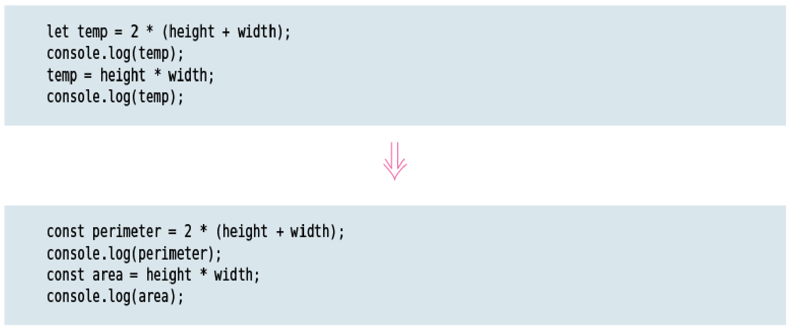
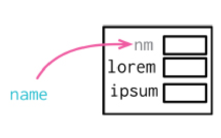
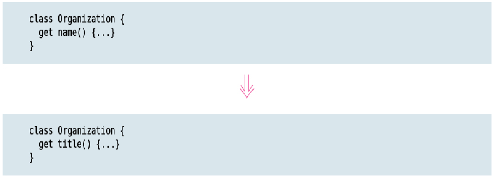
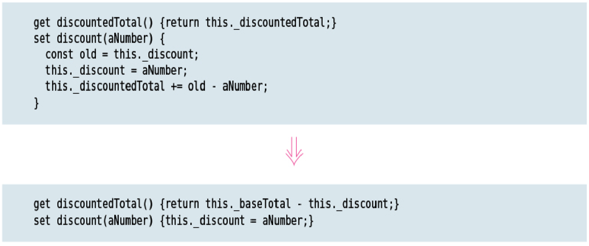
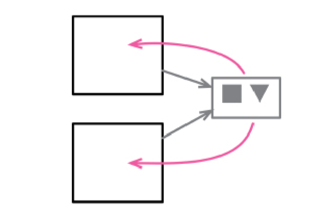
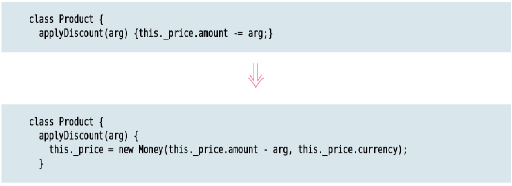
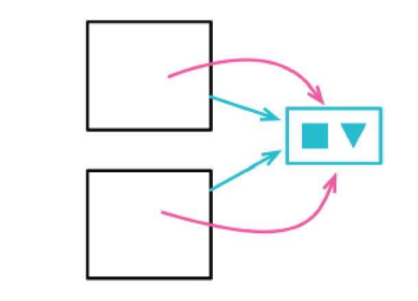
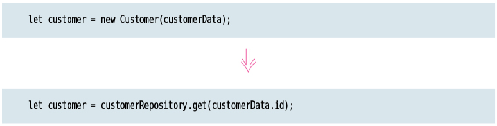

# Chapter 9 Organizing Data

Data structures play an important role in our programs, so it’s no great shock that I have a clutch of refactorings that focus on them. A value that’s used for different purposes is a breeding ground for confusion and bugs—so, when I see one, I use *`Split Variable (240)`* to separate the usages. As with any program element, getting a variable’s name right is tricky and important, so *`Rename Variable (137)`* is often my friend. But sometimes the best thing I can do with a variable is to get rid of it completely—with *`Replace Derived Variable with Query (248)`*.

I often find problems in a code base due to a confusion between references and values, so I use *`Change Reference to Value (252)`* and *`Change Value to Reference (256)`* to change between these styles.

## SPLIT VARIABLE

formerly: *`Remove Assignments to Parameters`*

formerly: *`Split Temp`*

### Motivation

Many other variables are used to hold the result of a long­winded bit of code for easy reference later. These kinds of variables should be set only once. If they are set more than once, it is a sign that they have more than one responsibility within the method. Any variable with more than one responsibility should be replaced with multiple variables, one for each responsibility. Using a variable for two different things is very confusing for the reader.

### Mechanics

* Change the name of the variable at its declaration and first assignment.

    If the later assignments are of the form i = i + something, that is a collecting variable, so don’t split it. A collecting variable is often used for calculating sums, string concatenation, writing to a stream, or adding to a collection.

* If possible, declare the new variable as immutable.

* Change all references of the variable up to its second assignment.

* Test.

* Repeat in stages, at each stage renaming the variable at the declaration and changing references until the next assignment, until you reach the final assignment.

## RENAME FIELD

### Motivation

Names are important, and field names in record structures can be especially important when those record structures are widely used across a program. Data structures play a particularly important role in understanding. Many years ago Fred Brooks said, “Show me your flowcharts and conceal your tables, and I shall continue to be mystified. Show me your tables, and I won’t usually need your flowcharts; they’ll be obvious.” While I don’t see many people drawing flowcharts these days, the adage remains valid. Data structures are the key to understanding what’s going on.

### Mechanics

* If the record has limited scope, rename all accesses to the field and test; no need to do the rest of the mechanics.

* If the record isn’t already encapsulated, apply *`Encapsulate Record (162)`*.

* Rename the private field inside the object, adjust internal methods to fit.

* Test.

* If the constructor uses the name, apply *`Change Function Declaration (124)`* to rename it.

* Apply *`Rename Function (124)`* to the accessors.

## REPLACE DERIVED VARIABLE WITH QUERY

### Motivation

One of the biggest sources of problems in software is mutable data. Data changes can often couple together parts of code in awkward ways, with changes in one part leading to knock­on effects that are hard to spot. In many situations it’s not realistic to entirely remove mutable data—but I do advocate minimizing the scope of mutable data at much as possible.

One way I can make a big impact is by removing any variables that I could just as easily calculate. A calculation often makes it clearer what the meaning of the data is, and it is protected from being corrupted when you fail to update the variable as the source data changes.

A reasonable exception to this is when the source data for the calculation is immutable and we can force the result to being immutable too. Transformation operations that create new data structures are thus reasonable to keep even if they could be replaced with calculations. Indeed, there is a duality here between objects that wrap a data structure with a series of calculated properties and functions that transform one data structure into another. The object route is clearly better when the source data changes and you would have to manage the lifetime of the derived data structures. But if the source data is immutable, or the derived data is very transient, then both approaches are effective.

### Mechanics

* Identify all points of update for the variable. If necessary, use *`Split Variable (240)`* to separate each point of update.

* Create a function that calculates the value of the variable.

* Use *`Introduce Assertion (302)`* to assert that the variable and the calculation give the same result whenever the variable is used.

    If necessary, use *`Encapsulate Variable (132)`* to provide a home for the assertion.

* Test.

* Replace any reader of the variable with a call to the new function.

* Test.

* Apply *`Remove Dead Code (237)`* to the declaration and updates to the variable.

## CHANGE REFERENCE TO VALUE

inverse of: *`Change Value to Reference (256)`*

### Motivation

When I nest an object, or data structure, within another I can treat the inner object as a reference or as a value. The difference is most obviously visible in how I handle updates of the inner object’s properties. If I treat it as a reference, I’ll update the inner object’s property keeping the same inner object. If I treat it as a value, I will replace the entire inner object with a new one that has the desired property.

If I treat a field as a value, I can change the class of the inner object to make it a Value Object [mf­vo]. Value objects are generally easier to reason about, particularly because they are immutable. In general, immutable data structures are easier to deal with. I can pass an immutable data value out to other parts of the program and not worry that it might change without the enclosing object being aware of the change. I can replicate values around my program and not worry about maintaining memory links. Value objects are especially useful in distributed and concurrent systems.

This also suggests when I shouldn’t do this refactoring. If I want to share an object between several objects so that any change to the shared object is visible to all its collaborators, then I need the shared object to be a reference.

### Mechanics

* Check that the candidate class is immutable or can become immutable.

* For each setter, apply *`Remove Setting Method (331)`*.

* Provide a value­based equality method that uses the fields of the value object.

    Most language environments provide an overridable equality function for this purpose. Usually you must override a hashcode generator method as well.

## CHANGE VALUE TO REFERENCE

### Motivation

A data structure may have several records linked to the same logical data structure. I might read in a list of orders, some of which are for the same customer. When I have sharing like this, I can represent it by treating the customer either as a value or as a reference. With a value, the customer data is copied into each order; with a reference, there is only one data structure that multiple orders link to.

If the customer never needs to be updated, then both approaches are reasonable. It is, perhaps, a bit confusing to have multiple copies of the same data, but it’s common enough to not be a problem. In some cases, there may be issues with memory due to multiple copies—but, like any performance issue, that’s relatively rare.

The biggest difficulty in having physical copies of the same logical data occurs when I need to update the shared data. I then have to find all the copies and update them all. If I miss one, I’ll get a troubling inconsistency in my data. In this case, it’s often worthwhile to change the copied data into a single reference. That way, any change is visible to all the customer’s orders.

Changing a value to a reference results in only one object being present for an entity, and it usually means I need some kind of repository where I can access these objects. I then only create the object for an entity once, and everywhere else I retrieve it from the repository.

### Mechanics

* Create a repository for instances of the related object (if one isn’t already present).

* Ensure the constructor has a way of looking up the correct instance of the related object.

* Change the constructors for the host object to use the repository to obtain the related object. Test after each change.
