# Chapter 10 Simplifying Conditional Logic

Much of the power of programs comes from their ability to implement conditional logic —but, sadly, much of the complexity of programs lies in these conditionals. I often use refactoring to make conditional sections easier to understand. I regularly apply *`Decompose Conditional (260)`* to complicated conditionals, and I use *`Consolidate Conditional Expression (263)`* to make logical combinations clearer. I use *`Replace Nested Conditional with Guard Clauses (266)`* to clarify cases where I want to run some pre­checks before my main processing. If I see several conditions using the same switching logic, it’s a good time to pull *`Replace Conditional with Polymorphism (272)`* out the box.

A lot of conditionals are used to handle special cases, such as nulls; if that logic is mostly the same, then *`Introduce Special Case (289)`* (often referred to as *`Introduce Null Object (289)`*) can remove a lot of duplicate code. And, although I like to remove conditions a lot, if I want to communicate (and check) a program’s state, I find *`Introduce Assertion (302)`* a worthwhile addition.

## DECOMPOSE CONDITIONAL

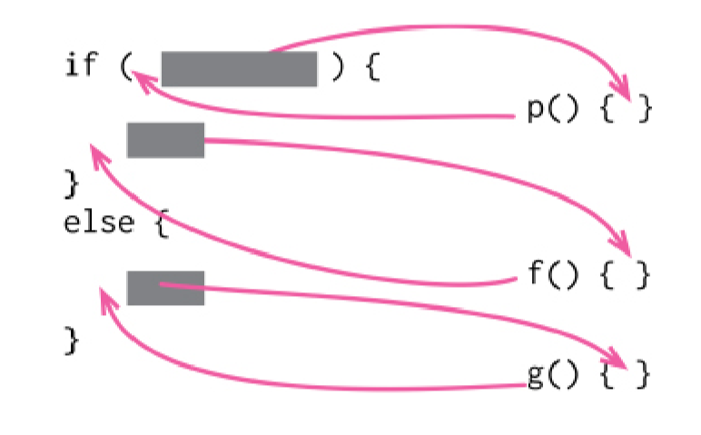

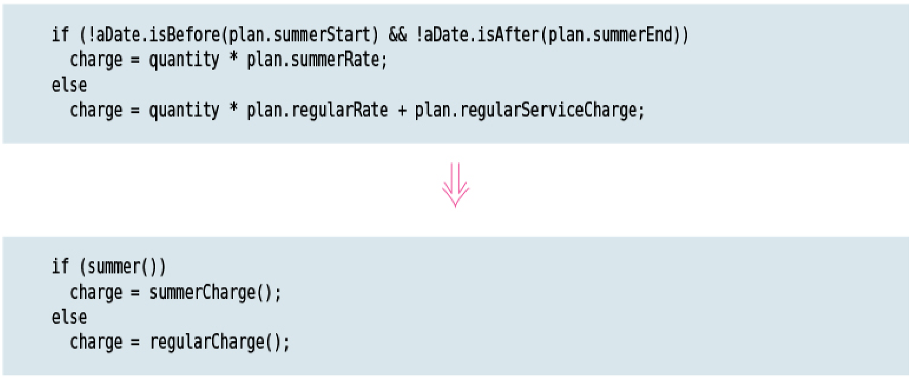

### Motivation

One of the most common sources of complexity in a program is complex conditional logic. As I write code to do various things depending on various conditions, I can quickly end up with a pretty long function. Length of a function is in itself a factor that makes it harder to read, but conditions increase the difficulty. The problem usually lies in the fact that the code, both in the condition checks and in the actions, tells me what happens but can easily obscure why it happens.

As with any large block of code, I can make my intention clearer by decomposing it and replacing each chunk of code with a function call named after the intention of that chunk. With conditions, I particularly like doing this for the conditional part and each of the alternatives. This way, I highlight the condition and make it clear what I’m branching on. I also highlight the reason for the branching.

This is really just a particular case of applying *`Extract Function (106)`* to my code, but I like to highlight this case as one where I’ve often found a remarkably good value for the exercise.

### Mechanics

* *`Apply Extract Function (106)`* on the condition and each leg of the conditional.

## CONSOLIDATE CONDITIONAL EXPRESSION

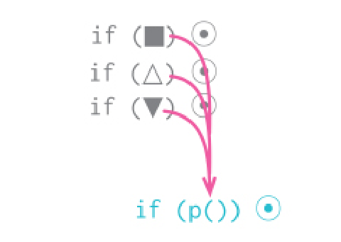

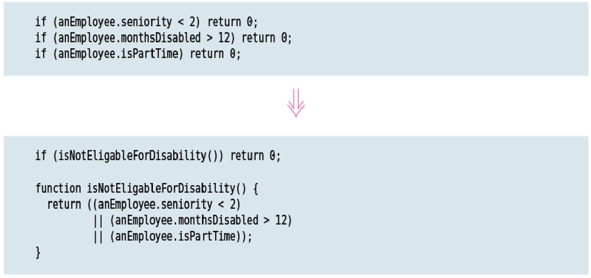

### Motivation

Sometimes, I run into a series of conditional checks where each check is different yet the resulting action is the same. When I see this, I use and and or operators to consolidate them into a single conditional check with a single result.

Consolidating the conditional code is important for two reasons. First, it makes it clearer by showing that I’m really making a single check that combines other checks. The sequence has the same effect, but it looks like I’m carrying out a sequence of separate checks that just happen to be close together. The second reason I like to do this is that it often sets me up for *`Extract Function (106)`*. Extracting a condition is one of the most useful things I can do to clarify my code. It replaces a statement of what I’m doing with why I’m doing it.

The reasons in favor of consolidating conditionals also point to the reasons against doing it. If I consider it to be truly independent checks that shouldn’t be thought of as a single check, I don’t do the refactoring.

### Mechanics

* Ensure that none of the conditionals have any side effects.

    If any do, use *`Separate Query from Modifier (306)`* on them first.

* Take two of the conditional statements and combine their conditions using a logical operator.

    Sequences combine with or, nested if statements combine with and.

* Test.

* Repeat combining conditionals until they are all in a single condition.

* Consider using *`Extract Function (106)`* on the resulting condition.

## REPLACE NESTED CONDITIONAL WITH GUARD CLAUSES

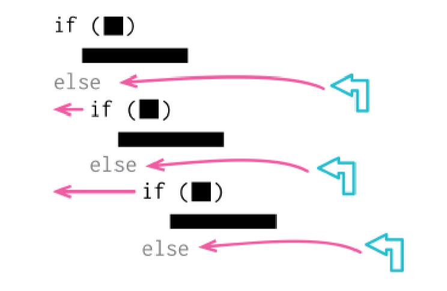

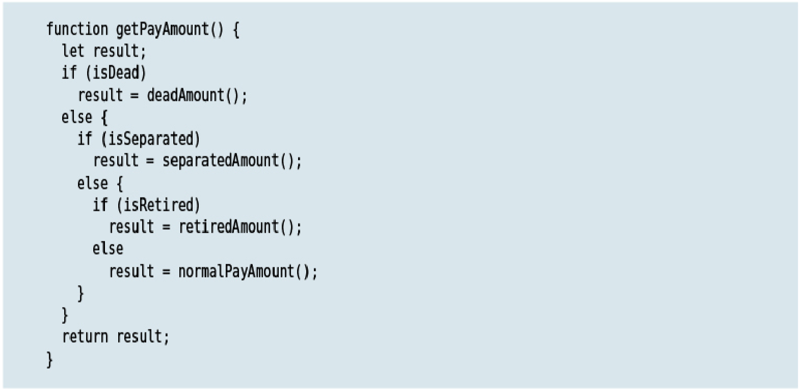
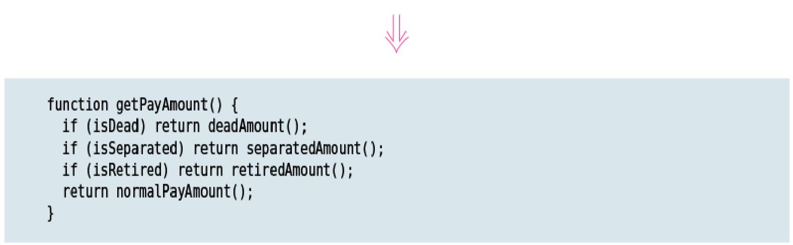

### Motivation

I often find that conditional expressions come in two styles. In the first style, both legs of the conditional are part of normal behavior, while in the second style, one leg is normal and the other indicates an unusual condition.

These kinds of conditionals have different intentions—and these intentions should come through in the code. If both are part of normal behavior, I use a condition with an if and an else leg. If the condition is an unusual condition, I check the condition and return if it’s true. This kind of check is often called a guard clause.

The key point of Replace Nested Conditional with Guard Clauses is emphasis. If I’m using an if­then­else construct, I’m giving equal weight to the if leg and the else leg.

This communicates to the reader that the legs are equally likely and important. Instead, the guard clause says, “This isn’t the core to this function, and if it happens, do something and get out.”

I often find I use Replace Nested Conditional with Guard Clauses when I’m working with a programmer who has been taught to have only one entry point and one exit point from a method. One entry point is enforced by modern languages, but one exit point is really not a useful rule. Clarity is the key principle: If the method is clearer with one exit point, use one exit point; otherwise don’t.

### Mechanics

* Select outermost condition that needs to be replaced, and change it into a guard clause.

* Test.

* Repeat as needed.

* If all the guard clauses return the same result, use *`Consolidate Conditional Expression (263)`*.

## REPLACE CONDITIONAL WITH POLYMORPHISM

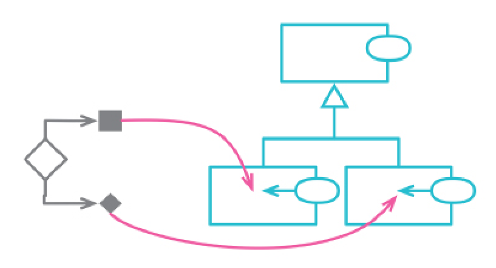

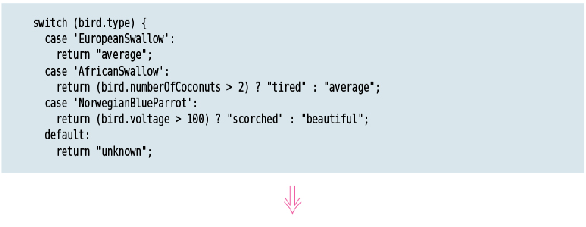
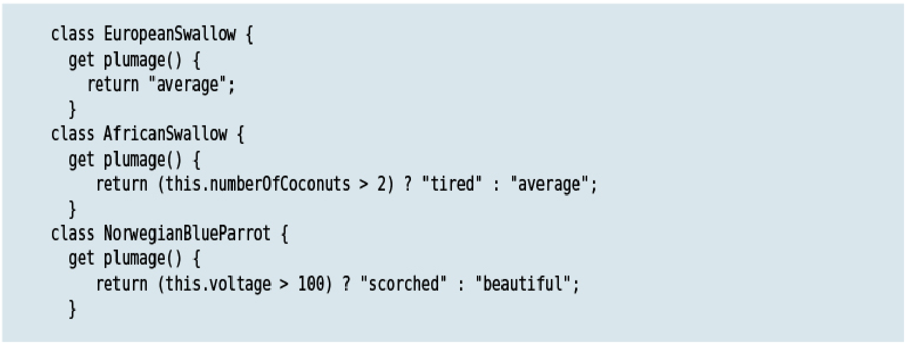

### Motivation

Complex conditional logic is one of the hardest things to reason about in programming, so I always look for ways to add structure to conditional logic. Often, I find I can separate the logic into different circumstances—high­level cases—to divide the conditions. Sometimes it’s enough to represent this division within the structure of a conditional itself, but using classes and polymorphism can make the separation more explicit.

A common case for this is where I can form a set of types, each handling the conditional logic differently. I might notice that books, music, and food vary in how they are handled because of their type. This is made most obvious when there are several functions that have a switch statement on a type code. In that case, I remove the duplication of the common switch logic by creating classes for each case and using polymorphism to bring out the type­specific behavior.

Another situation is where I can think of the logic as a base case with variants. The base case may be the most common or most straightforward. I can put this logic into a superclass which allows me to reason about it without having to worry about the variants. I then put each variant case into a subclass, which I express with code that emphasizes its difference from the base case.

Polymorphism is one of the key features of object­oriented programming—and, like any useful feature, it’s prone to overuse. I’ve come across people who argue that all examples of conditional logic should be replaced with polymorphism. I don’t agree with that view. Most of my conditional logic uses basic conditional statements—if/else and switch/case. But when I see complex conditional logic that can be improved as discussed above, I find polymorphism a powerful tool.

### Mechanics

* If classes do not exist for polymorphic behavior, create them together with a factory function to return the correct instance.

* Use the factory function in calling code.

* Move the conditional function to the superclass.

    If the conditional logic is not a self­contained function, use *`Extract Function (106)`* to make it so.

* Pick one of the subclasses. Create a subclass method that overrides the conditional statement method. Copy the body of that leg of the conditional statement into the subclass method and adjust it to fit.

* Repeat for each leg of the conditional.

* Leave a default case for the superclass method. Or, if superclass should be abstract, declare that method as abstract or throw an error to show it should be the responsibility of a subclass.

## INTRODUCE SPECIAL CASE

formerly: *`Introduce Null Object`*

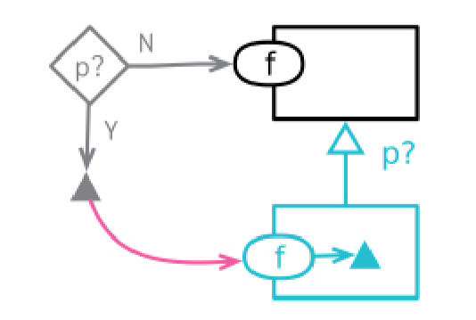

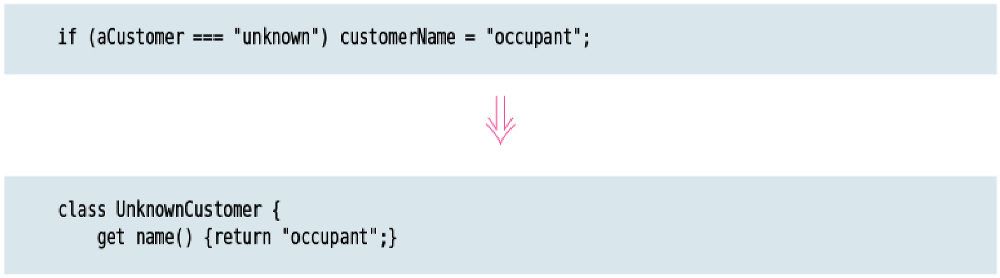

### Motivation

A common case of duplicated code is when many users of a data structure check a specific value, and then most of them do the same thing. If I find many parts of the code
base having the same reaction to a particular value, I want to bring that reaction into a single place.

A good mechanism for this is the Special Case pattern where I create a special­case element that captures all the common behavior. This allows me to replace most of the special­case checks with simple calls.

A special case can manifest itself in several ways. If all I’m doing with the object is reading data, I can supply a literal object with all the values I need filled in. If I need more behavior than simple values, I can create a special object with methods for all the common behavior. The special­case object can be returned by an encapsulating class, or inserted into a data structure with a transform.

A common value that needs special­case processing is null, which is why this pattern is often called the Null Object pattern. But it’s the same approach for any special case—I like to say that Null Object is a special case of Special Case.

### Mechanics

Begin with a container data structure (or class) that contains a property which is the subject of the refactoring. Clients of the container compare the subject property of the container to a special­case value. We wish to replace the special­case value of the subject with a special case class or data structure.

* Add a special­case check property to the subject, returning false.

* Create a special­case object with only the special­case check property, returning true.

* Apply *`Extract Function (106)`* to the special­case comparison code. Ensure that all clients use the new function instead of directly comparing it.

* Introduce the new special­case subject into the code, either by returning it from a function call or by applying a transform function.

* Change the body of the special­case comparison function so that it uses the specialcase check property.

* Test.

* Use *`Combine Functions into Class (144)`* or *`Combine Functions into Transform (149)`* to move all of the common special­case behavior into the new element.

    Since the special­case class usually returns fixed values to simple requests, these may be handled by making the special case a literal record.

* Use *`Inline Function (115)`* on the special­case comparison function for the places where it’s still needed.

## INTRODUCE ASSERTION

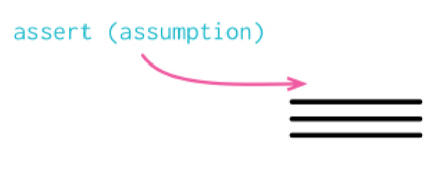

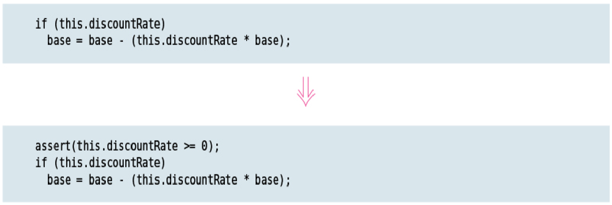

### Motivation

Often, sections of code work only if certain conditions are true. This may be as simple as a square root calculation only working on a positive input value. With an object, it
may require that at least one of a group of fields has a value in it.

Such assumptions are often not stated but can only be deduced by looking through an algorithm. Sometimes, the assumptions are stated with a comment. A better technique is to make the assumption explicit by writing an assertion.

An assertion is a conditional statement that is assumed to be always true. Failure of an assertion indicates a programmer error. Assertion failures should never be checked by other parts of the system. Assertions should be written so that the program functions equally correctly if they are all removed; indeed, some languages provide assertions that can be disabled by a compile­time switch.

I often see people encourage using assertions in order to find errors. While this is certainly a Good Thing, it’s not the only reason to use them. I find assertions to be a valuable form of communication—they tell the reader something about the assumed state of the program at this point of execution. I also find them handy for debugging, and their communication value means I’m inclined to leave them in once I’ve fixed the error I’m chasing. Self­testing code reduces their value for debugging, as steadily narrowing unit tests often do the job better, but I still like assertions for communication.

### Mechanics

* When you see that a condition is assumed to be true, add an assertion to state it.

Since assertions should not affect the running of a system, adding one is always behavior­preserving.
