# Chapter 11 Refactoring APIs

Modules and their functions are the building blocks of our software. APIs are the joints that we use to plug them together. Making these APIs easy to understand and use is important but also difficult: I need to refactor them as I learn how to improve them.

A good API clearly separates any functions that update data from those that only read data. If I see them combined, I use *`Separate Query from Modifier (306)`* to tease them apart. I can unify functions that only vary due to a value with *`Parameterize Function (310)`*. Some parameters, however, are really just a signal of an entirely different behavior and are best excised with *`Remove Flag Argument (314)`*.

Data structures are often unpacked unnecessarily when passed between functions; I prefer to keep them together with *`Preserve Whole Object (319)`*. Decisions on what should be passed as a parameter, and what can be resolved by the called function, are ones I often need to revisit with *`Replace Parameter with Query (324)`* and *`Replace Query with Parameter (327)`*.

The last two refactorings address the difficulty of breaking down a particularly complex function that passes a lot of data around. I can turn that function into an object with *`Replace Function with Command (337)`*, which makes it easier to use *`Extract Function (106)`* on the function’s body. If I later simplify the function and no longer need it as a command object, I turn it back into a function with *`Replace Command with Function (344)`*.

## SEPARATE QUERY FROM MODIFIER

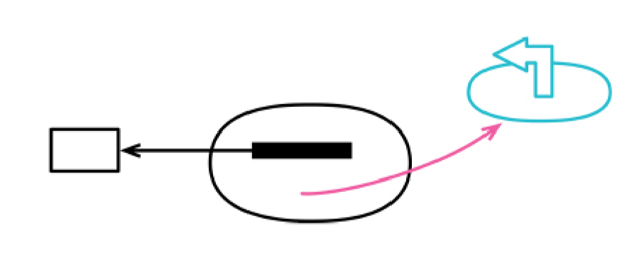

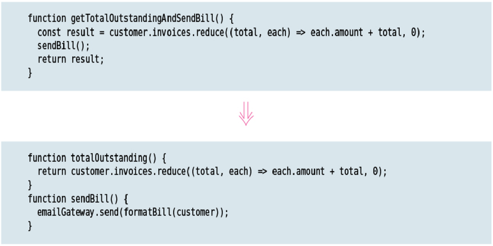

### Motivation

When I have a function that gives me a value and has no observable side effects, I have a very valuable thing. I can call this function as often as I like. I can move the call to other places in a calling function. It’s easier to test. In short, I have a lot less to worry about.

It is a good idea to clearly signal the difference between functions with side effects and those without. A good rule to follow is that any function that returns a value should not have observable side effects—the command­query separation [mf­cqs]. Some programmers treat this as an absolute rule. I’m not 100 percent pure on this (as on anything), but I try to follow it most of the time, and it has served me well.

If I come across a method that returns a value but also has side effects, I always try to separate the query from the modifier.

Note that I use the phrase observable side effects. A common optimization is to cache the value of a query in a field so that repeated calls go quicker. Although this changes the state of the object with the cache, the change is not observable. Any sequence of queries will always return the same results for each query.

### Mechanics

* Copy the function, name it as a query.

    Look into the function to see what is returned. If the query is used to populate a variable, the variable’s name should provide a good clue.

* Remove any side effects from the new query function.

* Run static checks.

* Find each call of the original method. If that call uses the return value, replace the original call with a call to the query and insert a call to the original method below it. Test after each change.

* Remove return values from original.

* Test.

Often after doing this there will be duplication between the query and the original method that can be tidied up.

## PARAMETERIZE FUNCTION

formerly: *`Parameterize Method`*

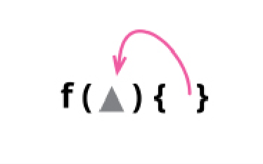

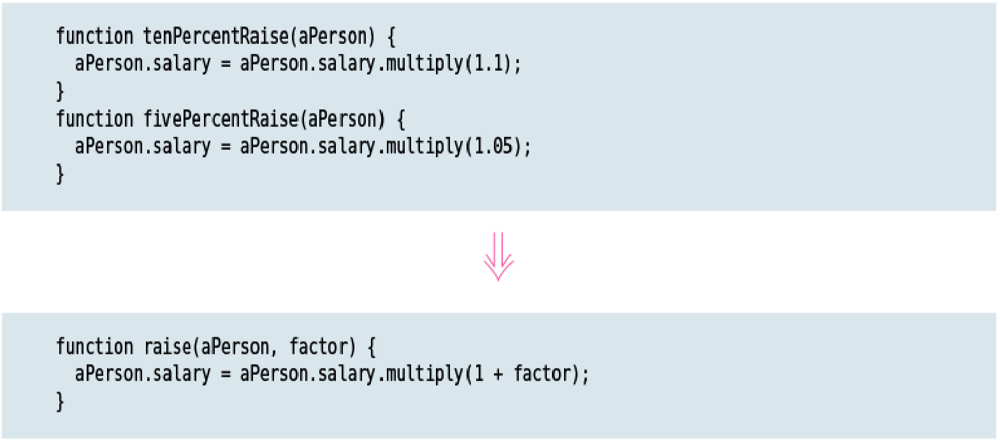

### Motivation

If I see two functions that carry out very similar logic with different literal values, I can remove the duplication by using a single function with parameters for the different values. This increases the usefulness of the function, since I can apply it elsewhere with different values.

### Mechanics

* Select one of the similar methods.

* Use *`Change Function Declaration (124)`* to add any literals that need to turn into parameters.

* For each caller of the function, add the literal value.

* Test.

* Change the body of the function to use the new parameters. Test after each change.

* For each similar function, replace the call with a call to the parameterized function. Test after each one.

    If the original parameterized function doesn’t work for a similar function, adjust it for the new function before moving on to the next.

## REMOVE FLAG ARGUMENT

formerly: *`Replace Parameter with Explicit Methods`*

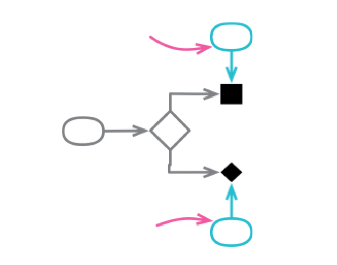

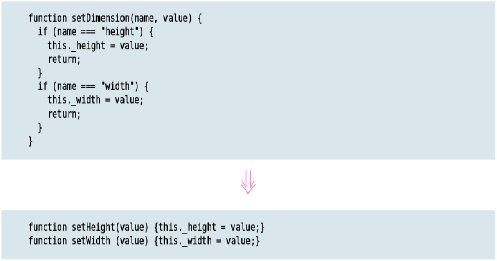

### Motivation

A flag argument is a function argument that the caller uses to indicate which logic the called function should execute. I may call a function that looks like this:

### Mechanics

* Create an explicit function for each value of the parameter.

    If the main function has a clear dispatch conditional, use *`Decompose Conditional (260)`* to create the explicit functions. Otherwise, create wrapping functions.

* For each caller that uses a literal value for the parameter, replace it with a call to the explicit function.

## PRESERVE WHOLE OBJECT

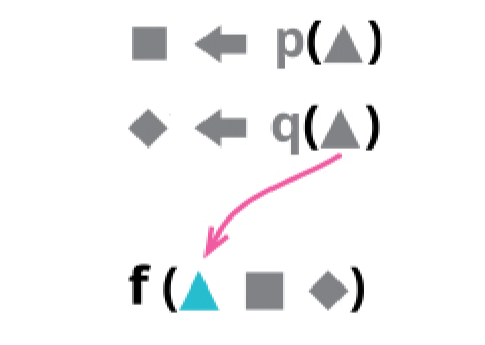

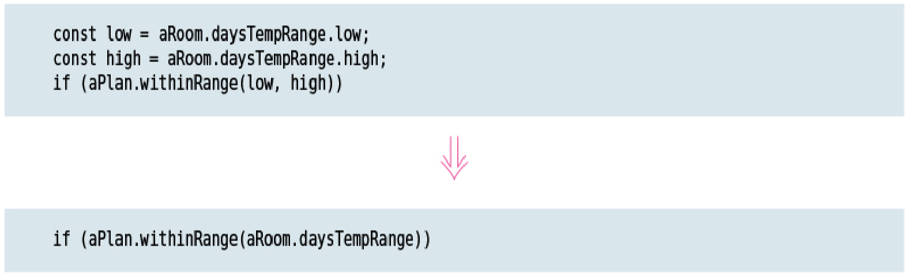

### Motivation

If I see code that derives a couple of values from a record and then passes these values into a function, I like to replace those values with the whole record itself, letting the function body derive the values it needs.

Passing the whole record handles change better should the called function need more data from the whole in the future—that change would not require me to alter the parameter list. It also reduces the size of the parameter list, which usually makes the
function call easier to understand. If many functions are called with the parts, they often duplicate the logic that manipulates these parts—logic that can often be moved to the whole.

The main reason I wouldn’t do this is if I don’t want the called function to have a dependency on the whole—which typically occurs when they are in different modules.

Pulling several values from an object to do some logic on them alone is a smell (*`Feature Envy (77)`*), and usually a signal that this logic should be moved into the whole itself. Preserve Whole Object is particularly common after I’ve done *`Introduce Parameter Object (140)`*, as I hunt down any occurrences of the original data clump to replace them with the new object.

If several bits of code only use the same subset of an object’s features, then that may indicate a good opportunity for *`Extract Class (182)`*.

One case that many people miss is when an object calls another object with several of its own data values. If I see this, I can replace those values with a self­reference (this in JavaScript).

### Mechanics

* Create an empty function with the desired parameters.

    Give the function an easily searchable name so it can be replaced at the end.

* Fill the body of the new function with a call to the old function, mapping from the new parameters to the old ones.

* Run static checks.

* Adjust each caller to use the new function, testing after each change.

    This may mean that some code that derives the parameter isn’t needed, so can fall to *`Remove Dead Code (237)`*.

* Once all original callers have been changed, use *`Inline Function (115)`* on the original function.

* Change the name of the new function and all its callers.

## REPLACE PARAMETER WITH QUERY

formerly: *`Replace Parameter with Method`*

inverse of: *`Replace Query with Parameter (327)`*

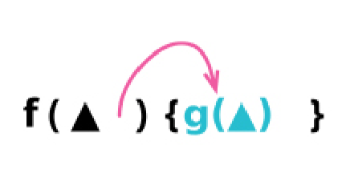

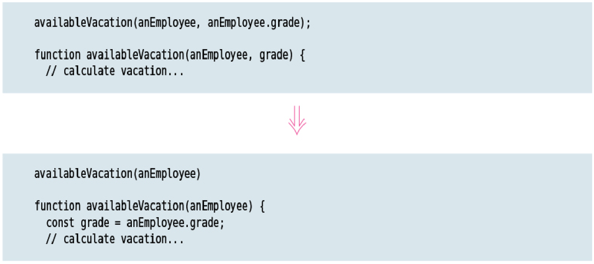

### Motivation

The parameter list to a function should summarize the points of variability of that function, indicating the primary ways in which that function may behave differently. As with any statement in code, it’s good to avoid any duplication, and it’s easier to understand if the parameter list is short.

If a call passes in a value that the function can just as easily determine for itself, that’s a form of duplication—one that unnecessarily complicates the caller which has to determine the value of a parameter when it could be freed from that work.

The limit on this is suggested by the phrase “just as easily.” By removing the parameter, I’m shifting the responsibility for determining the parameter value. When the parameter is present, determining its value is the caller’s responsibility; otherwise, that responsibility shifts to the function body. My usual habit is to simplify life for callers, which implies moving responsibility to the function body—but only if that responsibility is appropriate there.

The most common reason to avoid Replace Parameter with Query is if removing the parameter adds an unwanted dependency to the function body—forcing it to access a program element that I’d rather it remained ignorant of. This may be a new dependency, or an existing one that I’d like to remove. Usually this comes up where I’d need to add a problematic function call to the function body, or access something within a receiver object that I’d prefer to move out later.

The safest case for Replace Parameter with Query is when the value of the parameter I
want to remove is determined merely by querying another parameter in the list. There’s rarely any point in passing two parameters if one can be determined from the other.

One thing to watch out for is if the function I’m looking at has referential transparency —that is, if I can be sure that it will behave the same way whenever it’s called with the same parameter values. Such functions are much easier to reason about and test, and I don’t want to alter them to lose that property. So I wouldn’t replace a parameter with an access to a mutable global variable.

### Mechanics

* If necessary, use *`Extract Function (106)`* on the calculation of the parameter.

* Replace references to the parameter in the function body with references to the expression that yields the parameter. Test after each change.

* Use *`Change Function Declaration (124)`* to remove the parameter.

## REPLACE QUERY WITH PARAMETER

inverse of: *`Replace Parameter with Query (324)`*

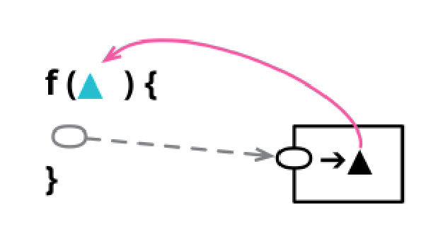

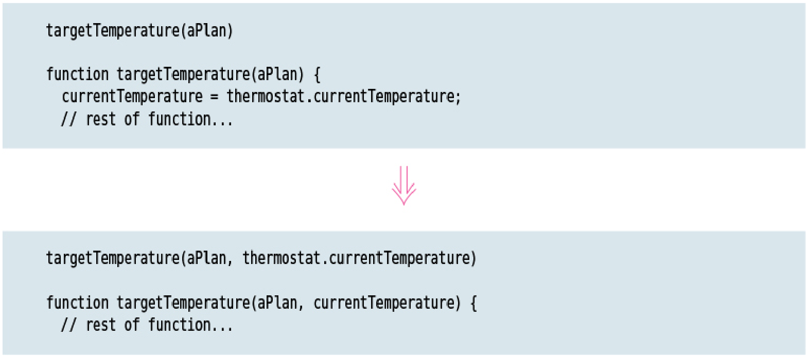

### Motivation

When looking through a function’s body, I sometimes see references to something in the function’s scope that I’m not happy with. This might be a reference to a global variable, or to an element in the same module that I intend to move away. To resolve this, I need to replace the internal reference with a parameter, shifting the responsibility of resolving the reference to the caller of the function.

Most of these cases are due to my wish to alter the dependency relationships in the code —to make the target function no longer dependent on the element I want to parameterize. There’s a tension here between converting everything to parameters, which results in long repetitive parameter lists, and sharing a lot of scope which can lead to a lot of coupling between functions. Like most tricky decisions, it’s not something I can reliably get right, so it’s important that I can reliably change things so the program can take advantage of my increasing understanding.

It’s easier to reason about a function that will always give the same result when called with same parameter values—this is called referential transparency. If a function accesses some element in its scope that isn’t referentially transparent, then the containing function also lacks referential transparency. I can fix that by moving that element to a parameter. Although such a move will shift responsibility to the caller, there is often a lot to be gained by creating clear modules with referential transparency. A common pattern is to have modules consisting of pure functions which are wrapped by logic that handles the I/O and other variable elements of a program. I can use Replace Query with Parameter to purify parts of a program, making those parts easier to test and reason about.

But Replace Query with Parameter isn’t just a bag of benefits. By moving a query to a parameter, I force my caller to figure out how to provide this value. This complicates life for callers of the functions, and my usual bias is to design interfaces that make life easier for their consumers. In the end, it boils down to allocation of responsibility around the program, and that’s a decision that’s neither easy nor immutable—which is why this refactoring (and its inverse) is one that I need to be very familiar with.

### Mechanics

* Use *`Extract Variable (119)`* on the query code to separate it from the rest of the function body.

* Apply *`Extract Function (106)`* to the body code that isn’t the call to the query.

    Give the new function an easily searchable name, for later renaming.

* Use *`Inline Variable (123)`* to get rid of the variable you just created.

* Apply *`Inline Function (115)`* to the original function.

* Rename the new function to that of the original.

## REMOVE SETTING METHOD

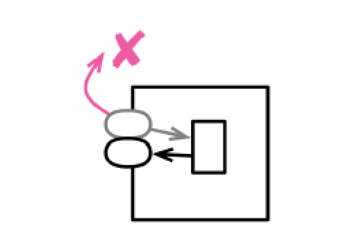

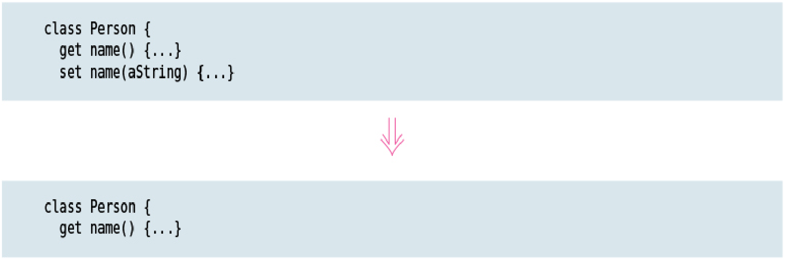

### Motivation

Providing a setting method indicates that a field may be changed. If I don’t want that field to change once the object is created, I don’t provide a setting method (and make the field immutable). That way, the field is set only in the constructor, my intention to have it not change is clear, and I usually remove the very possibility that the field will change.

There’s a couple of common cases where this comes up. One is where people always use accessor methods to manipulate a field, even within constructors. This leads to the only call to a setting method being from the constructor. I prefer to remove the setting method to make it clear that updates make no sense after construction.

Another case is where the object is created by clients using creation script rather than by a simple constructor call. Such a creation script starts with the constructor call followed by a sequence of setter method calls to create the new object. Once the script is finished, we don’t expect the new object to change some (or even all) of its fields. The setters are only expected to be called during this initial creation. In this case, I’d get rid of them to make my intentions clearer.

### Mechanics

* If the value that’s being set isn’t provided to the constructor, use *`Change Function Declaration (124)`* to add it. Add a call to the setting method within the constructor.

    If you wish to remove several setting methods, add all their values to the constructor at once. This simplifies the later steps.

* Remove each call of a setting method outside of the constructor, using the new constructor value instead. Test after each one.

    If you can’t replace the call to the setter by creating a new object (because you are updating a shared reference object), abandon the refactoring.

* Use *`Inline Function (115)`* on the setting method. Make the field immutable if possible.

* Test.

## REPLACE CONSTRUCTOR WITH FACTORY FUNCTION

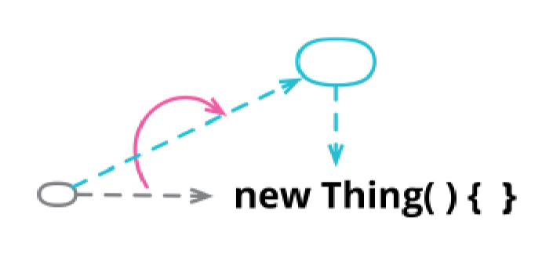

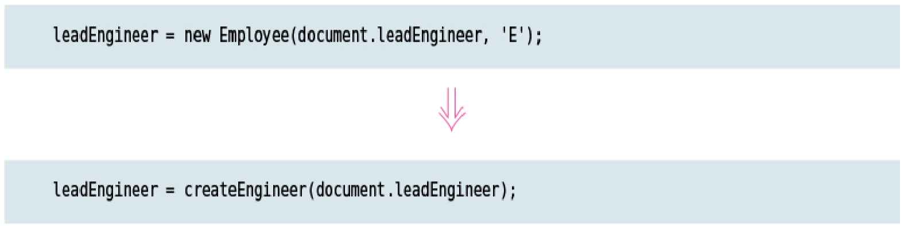

### Motivation

Many object­oriented languages have a special constructor function that’s called to
initialize an object. Clients typically call this constructor when they want to create a new object. But these constructors often come with awkward limitations that aren’t there for more general functions. A Java constructor must return an instance of the class it was called with, which means I can’t replace it with a subclass or proxy depending on the environment or parameters. Constructor naming is fixed, which makes it impossible for me to use a name that is clearer than the default. Constructors often require a special operator to invoke (“new” in many languages) which makes them difficult to use in contexts that expect normal functions.

A factory function suffers from no such limitations. It will likely call the constructor as part of its implementation, but I can freely substitute something else.

### Mechanics

* Create a factory function, its body being a call to the constructor.

* Replace each call to the constructor with a call to the factory function.

* Test after each change.

* Limit the constructor’s visibility as much as possible.

## REPLACE FUNCTION WITH COMMAND

formerly: *`Replace Method with Method Object`*

inverse of: *`Replace Command with Function (344)`*

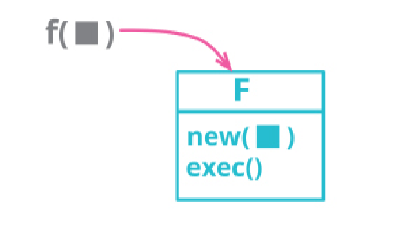

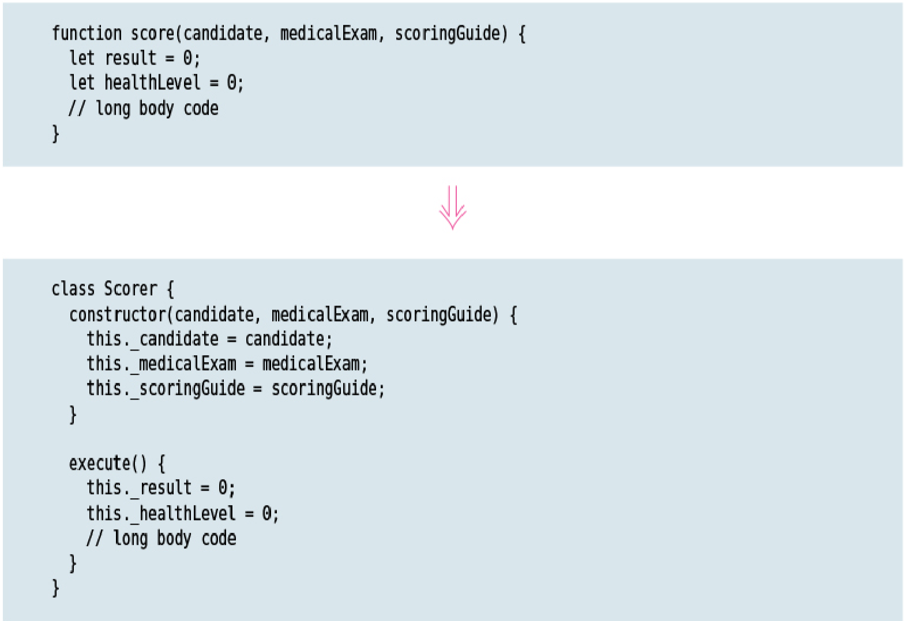

### Motivation

Functions—either freestanding or attached to objects as methods—are one of the fundamental building blocks of programming. But there are times when it’s useful to encapsulate a function into its own object, which I refer to as a “command object” or simply a **command**. Such an object is mostly built around a single method, whose request and execution is the purpose of the object.

A command offers a greater flexibility for the control and expression of a function than the plain function mechanism. Commands can have complimentary operations, such as undo. I can provide methods to build up their parameters to support a richer lifecycle. I can build in customizations using inheritance and hooks. If I’m working in a language with objects but without first­class functions, I can provide much of that capability by using commands instead. Similarly, I can use methods and fields to help break down a complex function, even in a language that lacks nested functions, and I can call those methods directly while testing and debugging.

All these are good reasons to use commands, and I need to be ready to refactor
functions into commands when I need to. But we must not forget that this flexibility, as ever, comes at a price paid in complexity. So, given the choice between a first­class function and a command, I’ll pick the function 95% of the time. I only use a command when I specifically need a facility that simpler approaches can’t provide.

Like many words in software development, “command” is rather overloaded. In the context I’m using it here, it is an object that encapsulates a request, following the command pattern in *`Design Patterns`*. When I use “command” in this sense, I use “command object” to set the context, and “command” afterwards. The word “command” is also used in the command­query separation principle [mf­cqs], where a command is an object method that changes observable state. I’ve always tried to avoid using command in that sense, preferring “modifier” or “mutator.”

### Mechanics

* Create an empty class for the function. Name it based on the function.

* Use *`Move Function (198)`* to move the function to the empty class.

    Keep the original function as a forwarding function until at least the end of the refactoring.

    Follow any convention the language has for naming commands. If there is no convention, choose a generic name for the command’s execute function, such as “execute” or “call”.

* Consider making a field for each argument, and move these arguments to the constructor.

## REPLACE COMMAND WITH FUNCTION

inverse of: *`Replace Function with Command (337)`*

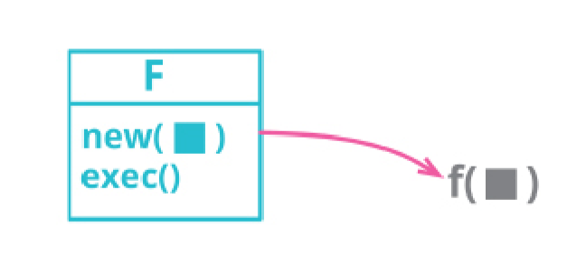

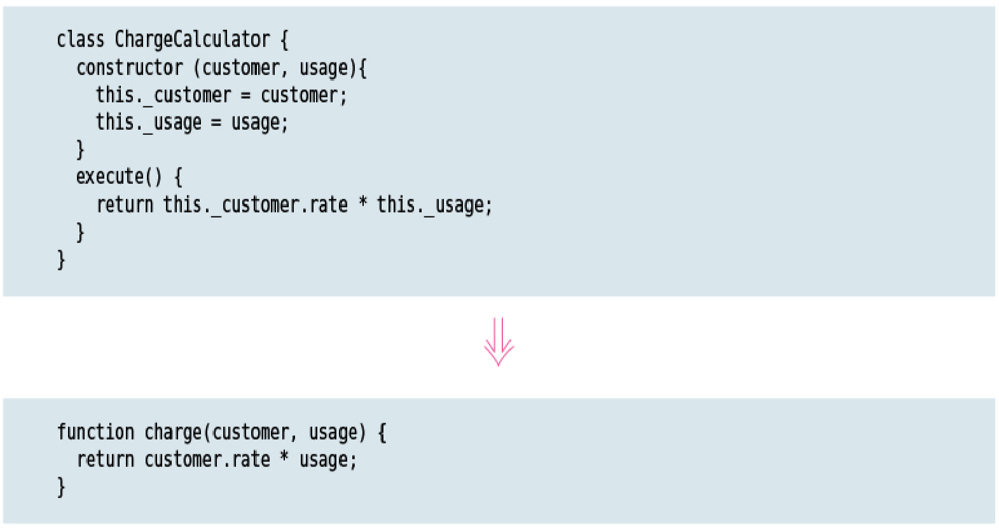

### Motivation

Command objects provide a powerful mechanism for handling complex computations. They can easily be broken down into separate methods sharing common state through the fields; they can be invoked via different methods for different effects; they can have their data built up in stages. But that power comes at a cost. Most of the time, I just want to invoke a function and have it do its thing. If that’s the case, and the function isn’t too complex, then a command object is more trouble than its worth and should be turned into a regular function.

### Mechanics

* Apply *`Extract Function (106)`* to the creation of the command and the call to the command’s execution method.

    This creates the new function that will replace the command in due course.

* For each method called by the command’s execution method, apply *`Inline Function (115)`*.

    If the supporting function returns a value, use *`Extract Variable (119)`* on the call first and then *`Inline Function (115)`*.

* Use *`Change Function Declaration (124)`* to put all the parameters of the constructor into the command’s execution method instead.

* For each field, alter the references in the command’s execution method to use the parameter instead. Test after each change.

* Inline the constructor call and command’s execution method call into the caller (which is the replacement function).

* Test.

* Apply *`Remove Dead Code (237)`* to the command class.
