# Chapter 12 Dealing with Inheritance

In this final chapter, I’ll turn to one of the best known features of object­oriented programming: inheritance. Like any powerful mechanism, it is both very useful and easy to misuse, and it’s often hard to see the misuse until it’s in the rear­view mirror.

Often, features need to move up or down the inheritance hierarchy. Several refactorings deal with that: *`Pull Up Method (350)`*, *`Pull Up Field (353)`*, *`Pull Up Constructor Body (355)`*, *`Push Down Method (359)`*, and *`Push Down Field (361)`*. I can add and remove classes from the hierarchy with *`Extract Superclass (375)`*, *`Remove Subclass (369)`*, and *`Collapse Hierarchy (380)`*. I may want to add a subclass to replace a field that I’m using to trigger different behavior based on its value; I do this with *`Replace Type Code with Subclasses (362)`*.

Inheritance is a powerful tool, but sometimes it gets used in the wrong place—or the place it’s used in becomes wrong. In that case, I use *`Replace Subclass with Delegate (381)`* or *`Replace Superclass with Delegate (399)`* to turn inheritance into delegation.

## PULL UP METHOD

inverse of: *`Push Down Method (359)`*

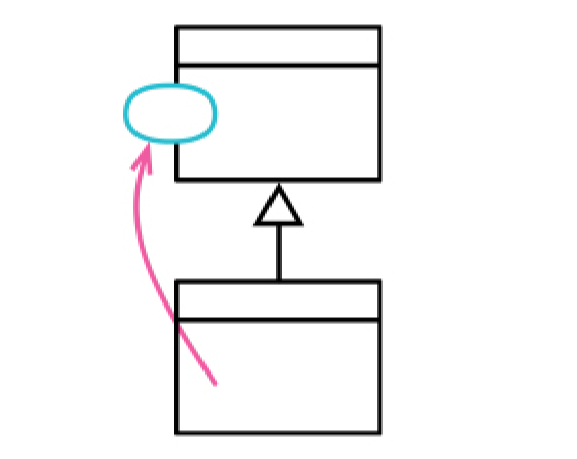

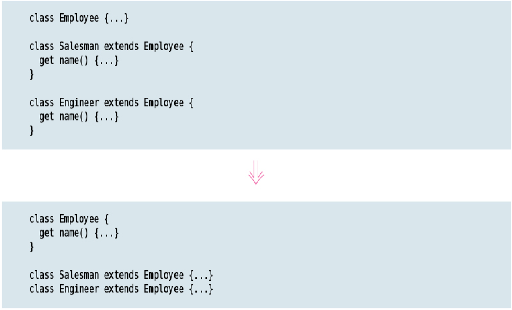

### Motivation

Eliminating duplicate code is important. Two duplicate methods may work fine as they are, but they are nothing but a breeding ground for bugs in the future. Whenever there is duplication, there is risk that an alteration to one copy will not be made to the other. Usually, it is difficult to find the duplicates.

The easiest case of using Pull Up Method is when the methods have the same body, implying there’s been a copy and paste. Of course it’s not always as obvious as that. I could just do the refactoring and see if the tests croak—but that puts a lot of reliance on my tests. I usually find it valuable to look for the differences—often, they show up behavior that I forgot to test for.

Often, Pull Up Method comes after other steps. I see two methods in different classes that can be parameterized in such a way that they end up as essentially the same method. In that case, the smallest step is for me to apply *`Parameterize Function (310)`* separately and then Pull Up Method.

The most awkward complication with Pull Up Method is if the body of the method refers to features that are on the subclass but not on the superclass. When that happens, I need to use *`Pull Up Field (353)`* and Pull Up Method on those elements first.

If I have two methods with a similar overall flow, but differing in details, I’ll consider the Form Template Method [mf­ft].

### Mechanics

* Inspect methods to ensure they are identical.

    If they do the same thing, but are not identical, refactor them until they have identical bodies.

* Check that all method calls and field references inside the method body refer to features that can be called from the superclass.

* If the methods have different signatures, use *`Change Function Declaration (124)`* to get them to the one you want to use on the superclass.

* Create a new method in the superclass. Copy the body of one of the methods over to it.

* Run static checks.

* Delete one subclass method.

* Test.

* Keep deleting subclass methods until they are all gone.

## PULL UP FIELD

inverse of: *`Push Down Field (361)`*

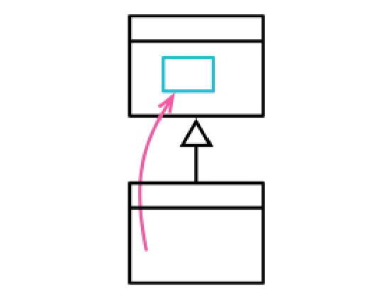

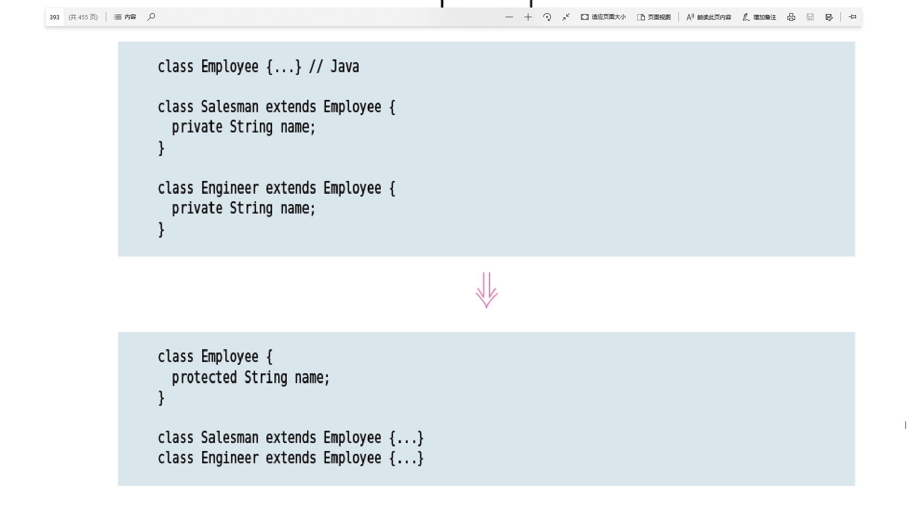

### Motivation

If subclasses are developed independently, or combined through refactoring, I often find that they duplicate features. In particular, certain fields can be duplicates. Such fields sometimes have similar names—but not always. The only way I can tell what is going on is by looking at the fields and examining how they are used. If they are being used in a similar way, I can pull them up into the superclass.

By doing this, I reduce duplication in two ways. I remove the duplicate data declaration and I can then move behavior that uses the field from the subclasses to the superclass.

Many dynamic languages do not define fields as part of their class definition—instead, fields appear when they are first assigned to. In this case, pulling up a field is essentially a consequence of *`Pull Up Constructor Body (355)`*.

### Mechanics

* Inspect all users of the candidate field to ensure they are used in the same way.

* If the fields have different names, use *`Rename Field (244)`* to give them the same name.

* Create a new field in the superclass.

    The new field will need to be accessible to subclasses (protected in common languages).

* Delete the subclass fields.

* Test.

## PULL UP CONSTRUCTOR BODY

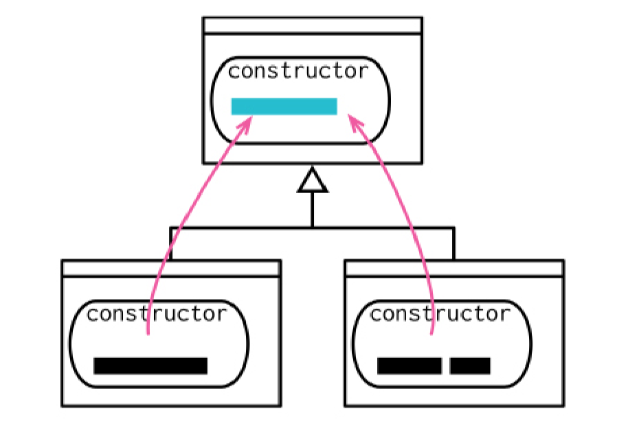

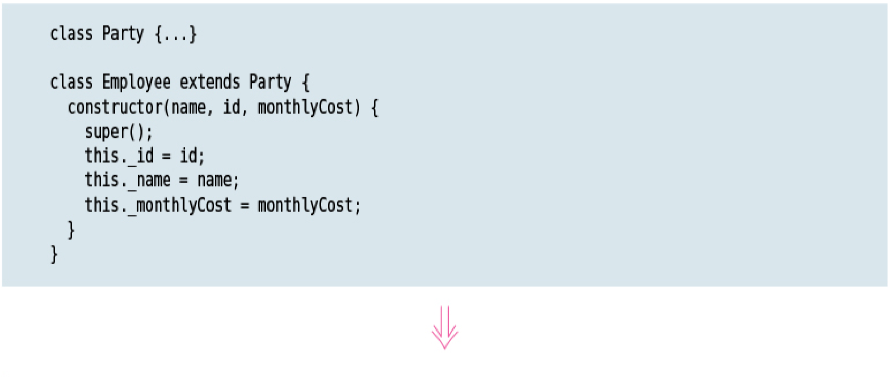
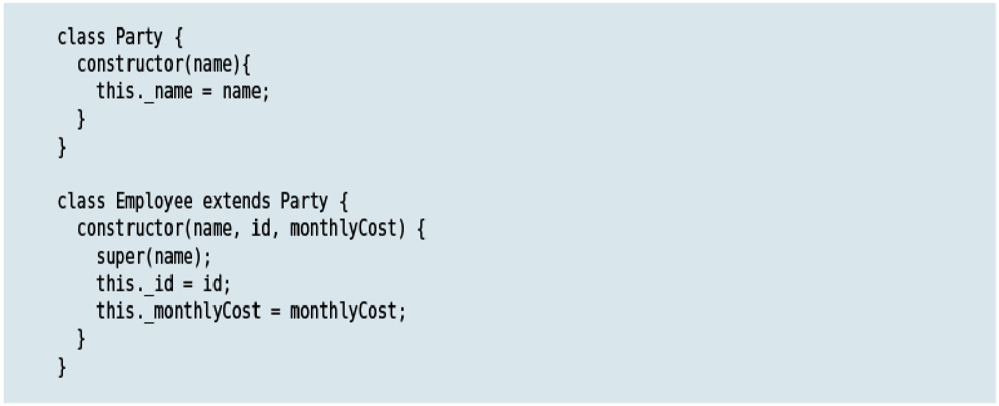

### Motivation

Constructors are tricky things. They aren’t quite normal methods—so I’m more restricted in what I can do with them.

If I see subclass methods with common behavior, my first thought is to use *`Extract Function (106)`* followed by *`Pull Up Method (350)`*, which will move it nicely into the superclass. Constructors tangle that—because they have special rules about what can be done in what order, so I need a slightly different approach.

If this refactoring starts getting messy, I reach for Replace Constructor with *`Factory Function (334)`*.

### Mechanics

* Define a superclass constructor, if one doesn’t already exist. Ensure it’s called by subclass constructors.

* Use *`Slide Statements (223)`* to move any common statements to just after the super call.

* Remove the common code from each subclass and put it in the superclass. Add to the super call any constructor parameters referenced in the common code.

* Test.

* If there is any common code that cannot move to the start of the constructor, use *`Extract Function (106)`* followed by *`Pull Up Method (350)`*.

## PUSH DOWN METHOD

inverse of: *`Pull Up Method (350)`*

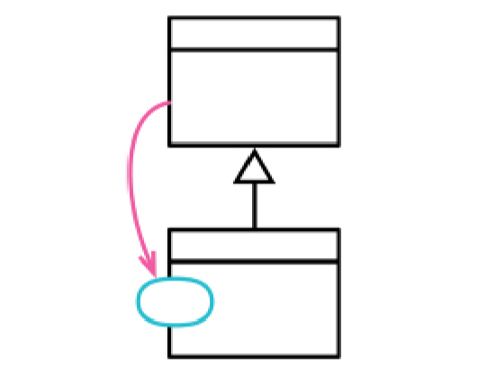

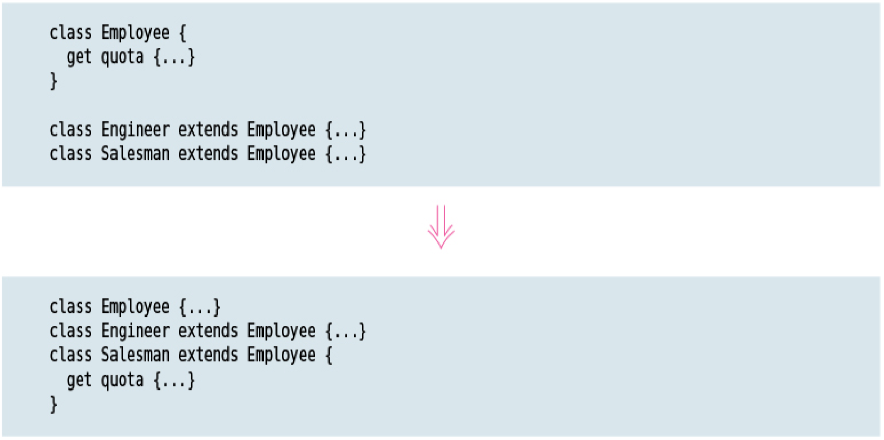

### Motivation

If a method is only relevant to one subclass (or a small proportion of subclasses), removing it from the superclass and putting it only on the subclass(es) makes that clearer. I can only do this refactoring if the caller knows it’s working with a particular subclass—otherwise, I should use *`Replace Conditional with Polymorphism (272)`* with some placebo behavior on the superclass.

### Mechanics

* Copy the method into every subclass that needs it.

* Remove the method from the superclass.

* Test.

* Remove the method from each superclass that doesn’t need it.

* Test.

## PUSH DOWN FIELD

inverse of: *`Pull Up Field (353)`*

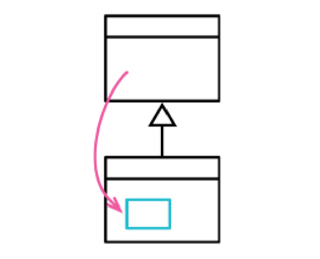

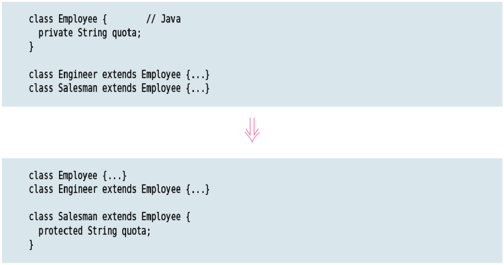

### Motivation

If a field is only used by one subclass (or a small proportion of subclasses), I move it to those subclasses.

### Mechanics

* Declare field in all subclasses that need it.

* Remove the field from the superclass.

* Test.

* Remove the field from all subclasses that don’t need it.

* Test.

## REPLACE TYPE CODE WITH SUBCLASSES

subsumes: *`Replace Type Code with State/Strategy`*

subsumes: *`Extract Subclass`*

inverse of: *`Remove Subclass (369)`*

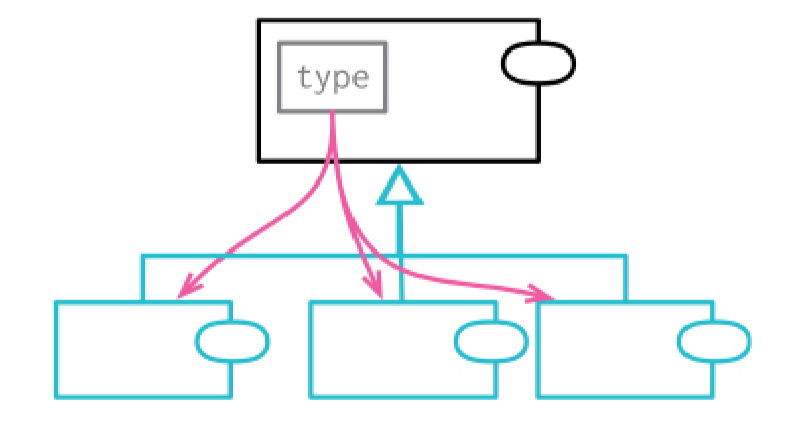

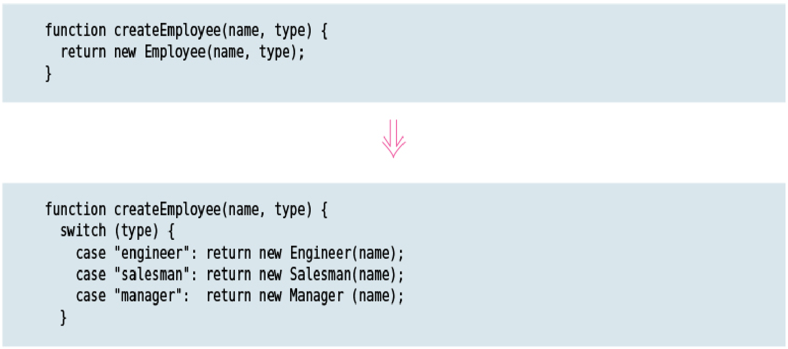

### Motivation

Software systems often need to represent different kinds of a similar thing. I may classify employees by their job type (engineer, manager, salesman), or orders by their priority (rush, regular). My first tool for handling this is some kind of type code field—
depending on the language, that might be an enum, symbol, string, or number. Often, this type code will come from an external service that provides me with the data I’m working on.

Most of the time, such a type code is all I need. But there are a couple of situations where I could do with something more, and that something more are subclasses. There are two things that are particularly enticing about subclasses. First, they allow me to use polymorphism to handle conditional logic. I find this most helpful when I have several functions that invoke different behavior depending on the value of the type code. With subclasses, I can apply *`Replace Conditional with Polymorphism (272)`* to these functions.

The second case is where I have fields or methods that are only valid for particular values of a type code, such as a sales quota that’s only applicable to the “salesman” type code. I can then create the subclass and apply *`Push Down Field (361)`*. While I can include validation logic to ensure a field is only used when the type code has the correct value, using a subclass makes the relationship more explicit.

When using Replace Type Code with Subclasses, I need to consider whether to apply it directly to the class I’m looking at, or to the type code itself. Do I make engineer a subtype of employee, or should I give the employee an employee type property which can have subtypes for engineer and manager? Using direct subclassing is simpler, but I can’t use it for the job type if I need it for something else. I also can’t use direct subclasses if the type is mutable. If I need to move the subclasses to an employee type property, I can do that by using *`Replace Primitive with Object (174)`* on the type code to create an employee type class and then using Replace Type Code with Subclasses on that new class.

### Mechanics

* Self­encapsulate the type code field.

* Pick one type code value. Create a subclass for that type code. Override the type code getter to return the literal type code value.

* Create selector logic to map from the type code parameter to the new subclass.

   With direct inheritance, use *`Replace Constructor with Factory Function (334)`* and put the selector logic in the factory. With indirect inheritance, the selector logic may stay in the constructor.

* Test.

* Repeat creating the subclass and adding to the selector logic for each type code value. Test after each change.

* Remove the type code field.

* Test.

* Use *`Push Down Method (359)`* and *`Replace Conditional with Polymorphism (272)`* on any methods that use the type code accessors. Once all are replaced, you can remove the type code accessors.

## REMOVE SUBCLASS

formerly: *`Replace Subclass with Fields`*

inverse of: *`Replace Type Code with Subclasses (362)`*

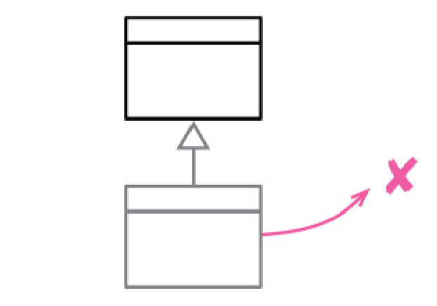

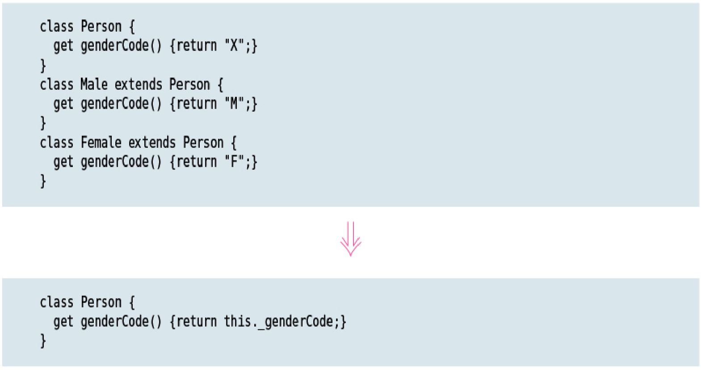

### Motivation

Subclasses are useful. They support variations in data structure and polymorphic behavior. They are a good way to program by difference. But as a software system evolves, subclasses can lose their value as the variations they support are moved to other places or removed altogether. Sometimes, subclasses are added in anticipation of features that never end up being built, or end up being built in a way that doesn’t need the subclasses.

A subclass that does too little incurs a cost in understanding that is no longer worthwhile. When that time comes, it’s best to remove the subclass, replacing it with a field on its superclass.

### Mechanics

* Use *`Replace Constructor with Factory Function (334)`* on the subclass constructor.

   If the clients of the constructors use a data field to decide which subclass to create, put that decision logic into a superclass factory method.

* If any code tests against the subclass’s types, use *`Extract Function (106)`* on the type
test and *`Move Function (198)`* to move it to the superclass. Test after each change.

* Create a field to represent the subclass type.

* Change the methods that refer to the subclass to use the new type field.

* Delete the subclass.

* Test.

Often, this refactoring is used on a group of subclasses at once—in which case carry out the steps to encapsulate them (add factory function, move type tests) first, then individually fold them into the superclass.

## EXTRACT SUPERCLASS

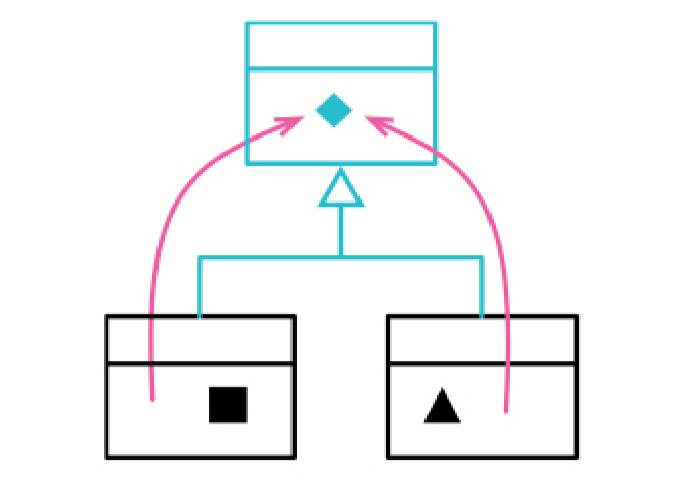

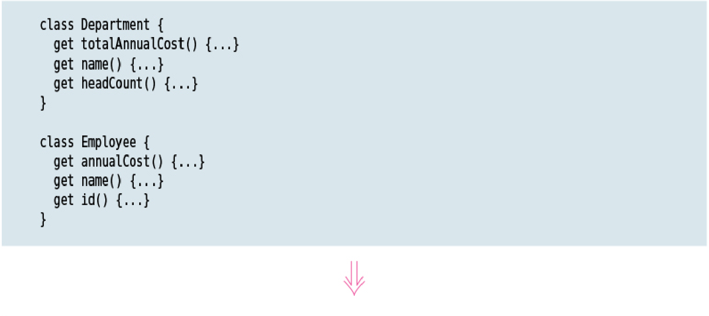
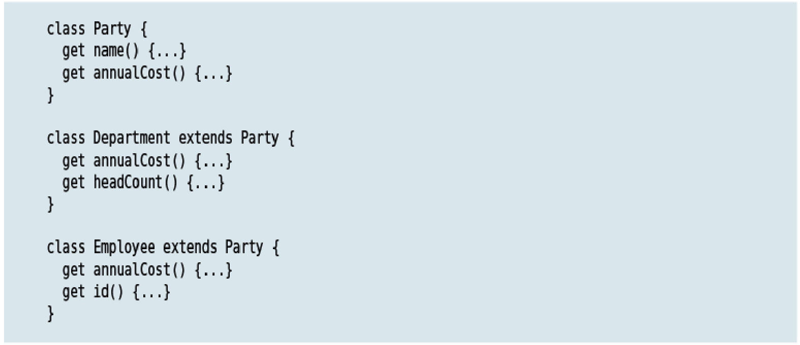

### Motivation

If I see two classes doing similar things, I can take advantage of the basic mechanism of inheritance to pull their similarities together into a superclass. I can use *`Pull Up Field (353)`* to move common data into the superclass, and *`Pull Up Method (350)`* to move the common behavior.

Many writers on object orientation treat inheritance as something that should be carefully planned in advance, based on some kind of classification structure in the “real world.” Such classification structures can be a hint towards using inheritance—but just
as often inheritance is something I realize during the evolution of a program, as I find common elements that I want to pull together.

An alternative to Extract Superclass is *`Extract Class (182)`*. Here you have, essentially, a choice between using inheritance or delegation as a way to unify duplicate behavior. Often Extract Superclass is the simpler approach, so I’ll do this first knowing I can use *`Replace Superclass with Delegate (399)`* should I need to later.

### Mechanics

* Create an empty superclass. Make the original classes its subclasses.

   If needed, use *`Change Function Declaration (124)`* on the constructors.

* Test.

* One by one, use *`Pull Up Constructor Body (355)`*, *`Pull Up Method (350)`*, and *`Pull Up Field (353)`* to move common elements to the superclass.

* Examine remaining methods on the subclasses. See if there are common parts. If so, use *`Extract Function (106)`* followed by *`Pull Up Method (350)`*.

* Check clients of the original classes. Consider adjusting them to use the superclass interface.

## COLLAPSE HIERARCHY

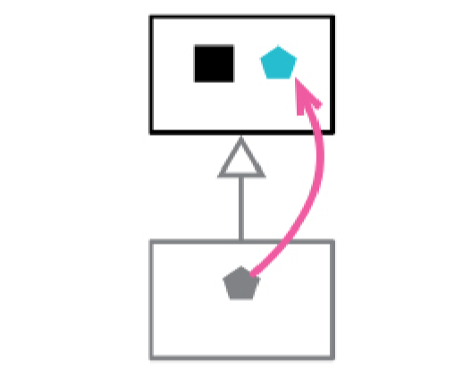

### Motivation

When I’m refactoring a class hierarchy, I’m often pulling and pushing features around. As the hierarchy evolves, I sometimes find that a class and its parent are no longer different enough to be worth keeping separate. At this point, I’ll merge them together.

### Mechanics

* Choose which one to remove.

   I choose based on which name makes most sense in the future. If neither name is best, I’ll pick one arbitrarily.

* Use *`Pull Up Field (353)`*, *`Push Down Field (361)`*, *`Pull Up Method (350)`*, and *`Push Down Method (359)`* to move all the elements into a single class.

* Adjust any references to the victim to change them to the class that will stay.

* Remove the empty class.

* Test.

## REPLACE SUBCLASS WITH DELEGATE
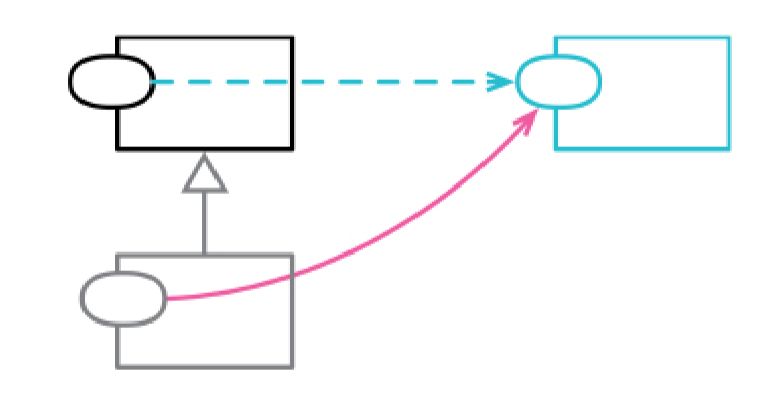

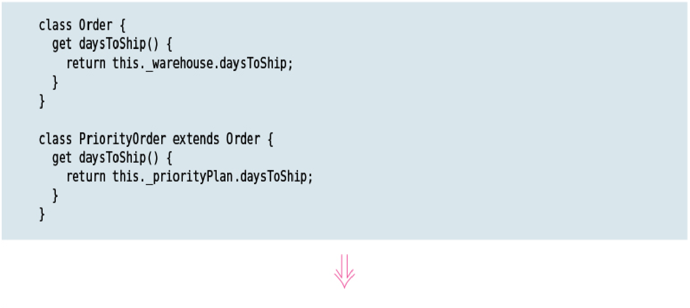
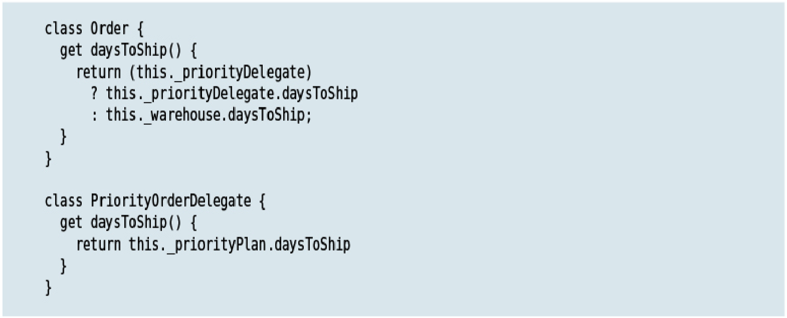

### Motivation

If I have some objects whose behavior varies from category to category, the natural mechanism to express this is inheritance. I put all the common data and behavior in the superclass, and let each subclass add and override features as needed. Object­oriented languages make this simple to implement and thus a familiar mechanism.

But inheritance has its downsides. Most obviously, it’s a card that can only be played once. If I have more than one reason to vary something, I can only use inheritance for a single axis of variation. So, if I want to vary behavior of people by their age category and by their income level, I can either have subclasses for young and senior, or for well­off and poor—I can’t have both.

A further problem is that inheritance introduces a very close relationship between classes. Any change I want to make to the parent can easily break children, so I have to be careful and understand how children derive from the superclass. This problem is made worse when the logic of the two classes resides in different modules and is looked after by different teams.

Delegation handles both of these problems. I can delegate to many different classes for different reasons. Delegation is a regular relationship between objects—so I can have a clear interface to work with, which is much less coupling than subclassing. It’s therefore common to run into the problems with subclassing and apply Replace Subclass with Delegate.

There is a popular principle: “Favor object composition over class inheritance” (where composition is effectively the same as delegation). Many people take this to mean “inheritance considered harmful” and claim that we should never use inheritance. I use inheritance frequently, partly because I always know I can use Replace Subclass with Delegate should I need to change it later. Inheritance is a valuable mechanism that does the job most of the time without problems. So I reach for it first, and move onto delegation when it starts to rub badly. This usage is actually consistent with the principle—which comes from the Gang of Four book [gof] that explains how inheritance and composition work together. The principle was a reaction to the overuse of inheritance.

Those who are familiar with the Gang of Four book may find it helpful to think of this refactoring as replacing subclasses with the State or Strategy patterns. Both of these patterns are structurally the same, relying on the host delegating to a separate hierarchy. Not all cases of Replace Subclass with Delegate involve an inheritance hierarchy for the delegate (as the first example below illustrates), but setting up a hierarchy for states or strategies is often useful.

### Mechanics

* If there are many callers for the constructors, apply Replace Constructor with *`Factory Function (334)`*.

* Create an empty class for the delegate. Its constructor should take any subclassspecific data as well as, usually, a back­reference to the superclass.

* Add a field to the superclass to hold the delegate.

* Modify the creation of the subclass so that it initializes the delegate field with an
instance of the delegate.

   This can be done in the factory function, or in the constructor if the constructor can reliably tell whether to create the correct delegate.

* Choose a subclass method to move to the delegate class.

* Use *`Move Function (198)`* to move it to the delegate class. Don’t remove the source’s delegating code.

   If the method needs elements that should move to the delegate, move them. If it needs elements that should stay in the superclass, add a field to the delegate that refers to the superclass.

* If the source method has callers outside the class, move the source’s delegating code from the subclass to the superclass, guarding it with a check for the presence of the delegate. If not, apply *`Remove Dead Code (237)`*.

   If there’s more than one subclass, and you start duplicating code within them, use *`Extract Superclass (375)`*. In this case, any delegating methods on the source superclass no longer need a guard if the default behavior is moved to the delegate superclass.

* Test.

* Repeat until all the methods of the subclass are moved.

* Find all callers of the subclasses’s constructor and change them to use the superclass constructor.

* Test.

* Use *`Remove Dead Code (237)`* on the subclass.

## REPLACE SUPERCLASS WITH DELEGATE

formerly: *Replace Inheritance with Delegation*

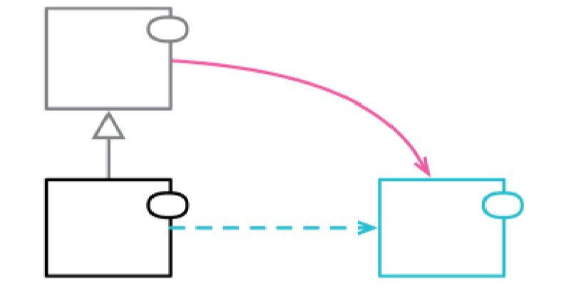

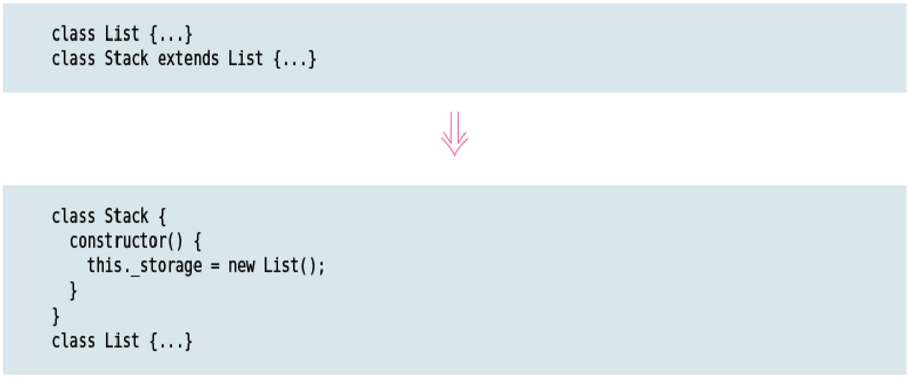

### Motivation

In object­oriented programs, inheritance is a powerful and easily available way to reuse existing functionality. I inherit from some existing class, then override and add additional features. But subclassing can be done in a way that leads to confusion and complication.

One of the classic examples of mis­inheritance from the early days of objects was making a stack be a subclass of list. The idea that led to this was reusing of list’s data storage and operations to manipulate it. While it’s good to reuse, this inheritance had a problem: All the operations of the list were present on the interface of the stack, although most of them were not applicable to a stack. A better approach is to make the list into a field of the stack and delegate the necessary operations to it.

This is an example of one reason to use Replace Superclass with Delegate—if functions
of the superclass don’t make sense on the subclass, that’s a sign that I shouldn’t be using inheritance to use the superclass’s functionality.

As well as using all the functions of the superclass, it should also be true that every instance of the subclass is an instance of the superclass and a valid object in all cases where we’re using the superclass. If I have a car model class, with things like name and engine size, I might think I could reuse these features to represent a physical car, adding functions for VIN number and manufacturing date. This is a common, and often subtle, modeling mistake which I’ve called the type­instance homonym [mf­tih].

These are both examples of problems leading to confusion and errors—which can be easily avoided by replacing inheritance with delegation to a separate object. Using delegation makes it clear that it is a separate thing—one where only some of the functions carry over.

Even in cases where the subclass is reasonable modeling, I use Replace Super­class with Delegate because the relationship between a sub­ and superclass is highly coupled, with the subclass easily broken by changes in the superclass. The downside is that I need to write a forwarding function for any function that is the same in the host and in the delegate—but, fortunately, even though such forwarding functions are boring to write, they are too simple to get wrong.

As a consequence of all this, some people advise avoiding inheritance entirely—but I don’t agree with that. Provided the appropriate semantic conditions apply (every method on the supertype applies to the subtype, every instance of the subtype is an instance of the supertype), inheritance is a simple and effective mechanism. I can easily apply Replace Superclass with Delegate should the situation change and inheritance is no longer the best option. So my advice is to (mostly) use inheritance first, and apply Replace Superclass with Delegate when (and if) it becomes a problem.

### Mechanics

* Create a field in the subclass that refers to the superclass object. Initialize this delegate reference to a new instance.

* For each element of the superclass, create a forwarding function in the subclass that forwards to the delegate reference. Test after forwarding each consistent group.

   Most of the time you can test after each function that’s forwarded, but, for example, get/set pairs can only be tested once both have been moved.

* When all superclass elements have been overridden with forwarders, remove the inheritance link.
